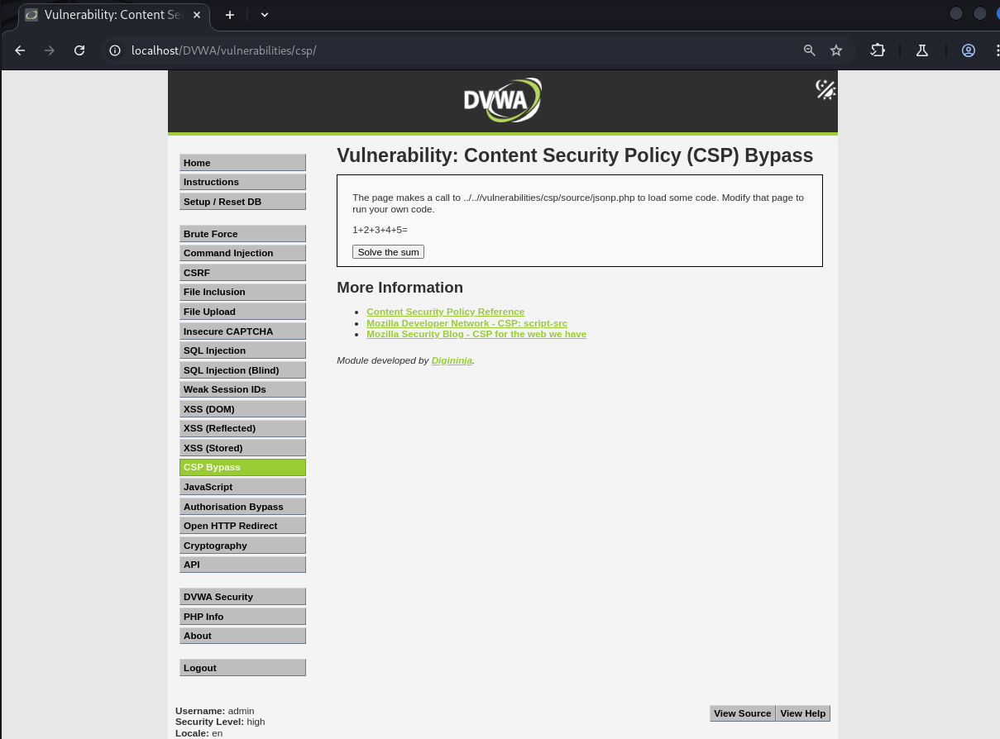
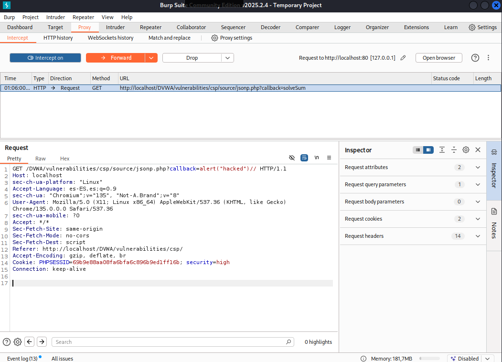
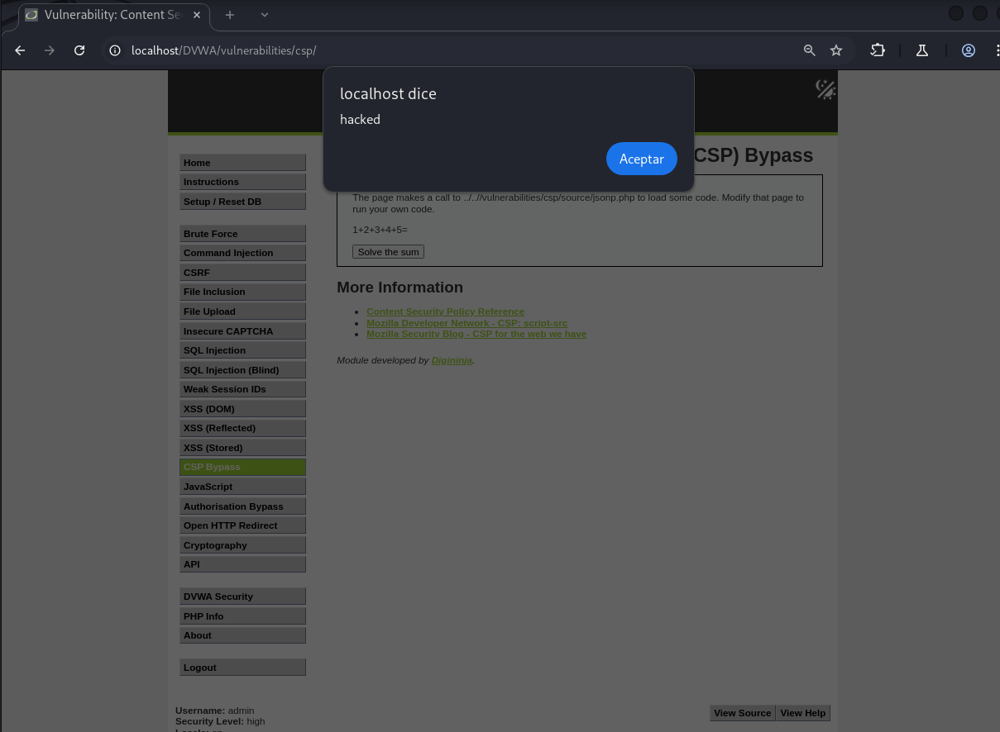

# Explotación de la CSP en DVWA - Nivel Alto

Este README describe brevemente cómo explotar una configuración de Content Security Policy (CSP) en el nivel de seguridad Alto del laboratorio web DVWA (Damn Vulnerable Web Application).

## Análisis del Comportamiento

En este nivel, la aplicación carga código dinámicamente mediante una petición al endpoint `/vulnerabilities/csp/source/jsonp.php`. Al interactuar con la funcionalidad "Solve the sum", se inserta una etiqueta `<script>` en el Document Object Model (DOM) con la URL de este recurso, pasando el nombre de una función como valor del parámetro `callback`:

```javascript
function clickButton() {
    var s = document.createElement("script");
    s.src = "source/jsonp.php?callback=solveSum";
    document.body.appendChild(s);
}
```
La cabecera de respuesta Content-Security-Policy permitirá la ejecución de scripts desde el mismo origen ('self').

## Explotación de la Vulnerabilidad
La estrategia para explotar la CSP en este nivel consiste en manipular el valor del parámetro `callback` en la petición GET dirigida a `/vulnerabilities/csp/source/jsonp.php`. Al inyectar código JavaScript malicioso dentro de este parámetro, seguido de un comentario para invalidar cualquier código adicional que la aplicación pudiera generar, podemos lograr la ejecución arbitraria de código.



**Pasos Detallados:**

1. Interceptar la Petición HTTP: Utiliza una herramienta de interceptación de tráfico web, como Burp Suite, para capturar la petición GET que se genera al hacer clic en el botón "Solve the sum". La petición inicial tendrá una estructura similar a la siguiente:

    ```javascript
    GET /vulnerabilities/csp/source/jsonp.php?callback=solveSum HTTP/1.1
    ```
2. Modificar el Parámetro `callback`: En la petición interceptada, localiza el parámetro callback en la URL. Reemplaza su valor original (`solveSum`) con el código JavaScript malicioso que deseas ejecutar. Es crucial encerrar este código dentro de una llamada a una función (aunque no sea realmente utilizada) y añadir un comentario (`//`) al final para asegurarte de que cualquier código posterior generado por la aplicación no interfiera con tu payload.

Por ejemplo, para ejecutar una simple alerta en el navegador, modifica el parámetro `callback` de la siguiente manera:

```javascript
alert("hacked")//
```

La URL modificada en la petición interceptada se verá así:

```javascript
GET /vulnerabilities/csp/source/jsonp.php?callback=alert("hacked")// HTTP/1.1
```


3. Reenviar la Petición Manipulada: Una vez que hayas modificado el parámetro `callback`, reenvía la petición alterada al servidor DVWA utilizando tu herramienta de interceptación.

**Resultado de la Explotación**

Al recibir la petición modificada, el servidor procesará el parámetro `callback` inyectado y generará una respuesta que contiene una etiqueta `<script>` con el código malicioso dentro de una llamada de función. Debido a que la CSP permite la carga de scripts desde el mismo origen (`'self'`), el navegador ejecutará el código JavaScript inyectado (`alert("hacked")//`), explotando de manera efectiva la política de seguridad configurada en el nivel Alto.

