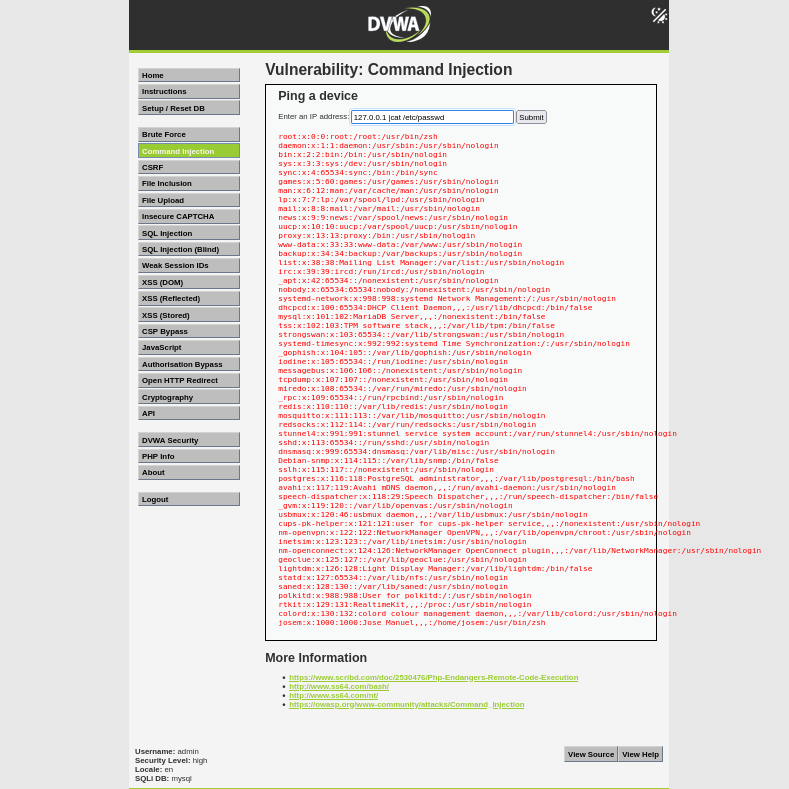

# Vulnerabilidad Command Injection - Nivel Alto (DVWA)

Este documento resume la explotación de la vulnerabilidad Command Injection en el nivel de seguridad Alto de Damn Vulnerable Web Application (DVWA), basado en la descripción proporcionada.

## Descripción de la Vulnerabilidad

La vulnerabilidad de Command Injection permite a un atacante ejecutar comandos arbitrarios en el sistema operativo del servidor a través de una entrada de usuario no sanitizada por la aplicación web.

## Nivel de Seguridad Alto

### Defensa Implementada

En este nivel, la aplicación intenta mitigar la vulnerabilidad reemplazando los caracteres `&`, `;` y `|` con espacios en la entrada del usuario.

### Técnica de Bypass

Según el análisis, se puede evadir esta defensa **eliminando el espacio despues del carácter de tubería (`|`)**.

### Pasos para Explotar

1.  **Identificar el punto de entrada:** El formulario solicita una dirección IP para realizar un ping.
2.  **Intentar la técnica de bypass:** Ingresa la siguiente cadena en el campo de la dirección IP:
    ```
    127.0.0.1 |cat /etc/passwd
    ```
3.  **Analizar el resultado:** Si la explotación es exitosa, la página mostrará el resultado del comando `ping` seguido del contenido del archivo `/etc/passwd`. La ausencia de un espacio antes de la tubería podría impedir que la función de reemplazo detecte y bloquee el carácter.



## Conclusión

En el nivel de seguridad Alto, una manipulación sutil en la sintaxis de la inyección (omitiendo el espacio antes de la tubería) puede ser suficiente para বাইপাসar la defensa implementada. Este ejemplo subraya la importancia de una sanitización robusta y la consideración de diversas formas en que los atacantes pueden intentar evadir las medidas de seguridad.

**Advertencia:** Este ejercicio se realiza con fines educativos en un entorno controlado como DVWA. Nunca intentes explotar vulnerabilidades en sistemas para los que no tienes permiso.
