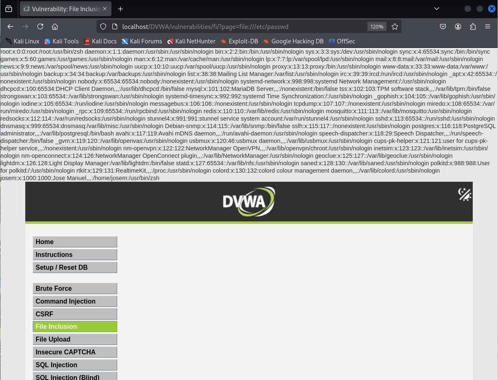

# Vulnerabilidad de File Inclusion - Nivel Alto

Este README describe brevemente la vulnerabilidad de File Inclusion y cómo explotarla en el nivel de seguridad Alto, basándonos en los ejemplos proporcionados.

## Resumen de la Vulnerabilidad de File Inclusion

La vulnerabilidad de File Inclusion ocurre cuando una aplicación web permite la inclusión o ejecución de archivos controlados por el usuario. Esto puede llevar a la exposición de información sensible o la ejecución de código malicioso.

Existen dos tipos principales:

* **Local File Inclusion (LFI):** Permite incluir archivos presentes en el servidor web.
* **Remote File Inclusion (RFI):** Permite incluir archivos desde un servidor remoto.

## Explotación de Local File Inclusion (LFI) - Nivel de Seguridad Alto

### Análisis de las Protecciones

En el nivel de seguridad Alto, la aplicación verifica que el archivo solicitado comience con `file` y sea `include.php`. Esto restringe el uso directo de técnicas de path traversal.

### Bypassing las Protecciones con el Protocolo `file://`

Para evitar estas restricciones y realizar una LFI, se puede utilizar el protocolo `file://`. Este protocolo permite acceder a archivos directamente desde el sistema de archivos local.

### Ejemplo para Acceder a `/etc/passwd`

La URL para acceder al archivo `/etc/passwd` utilizando el protocolo `file://` sería:

```
http://<IP_del_servidor>/DVWA/vulnerabilities/fi/?page=file:///etc/passwd
```


Al utilizar `file:///etc/passwd`, se indica a la aplicación que incluya el archivo especificado directamente desde el sistema de archivos local, evitando las comprobaciones implementadas.

### Verificación de la Inclusión

Si la explotación es exitosa, el contenido del archivo `/etc/passwd` se mostrará en la página web.

En resumen, en el nivel de seguridad Alto, la explotación de la vulnerabilidad LFI se logra evitandodo las restricciones mediante el uso del protocolo `file://` para acceder a archivos locales del sistema.


