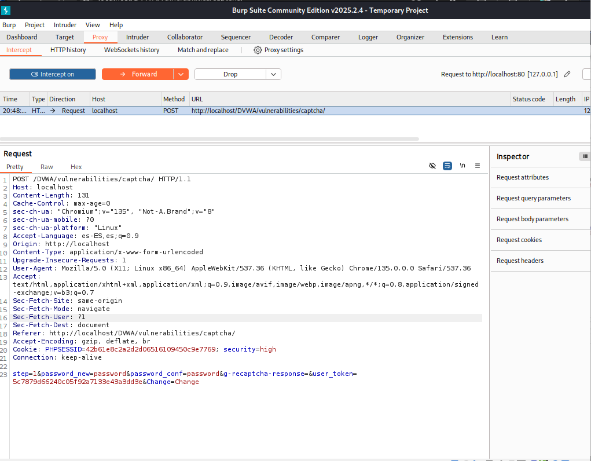
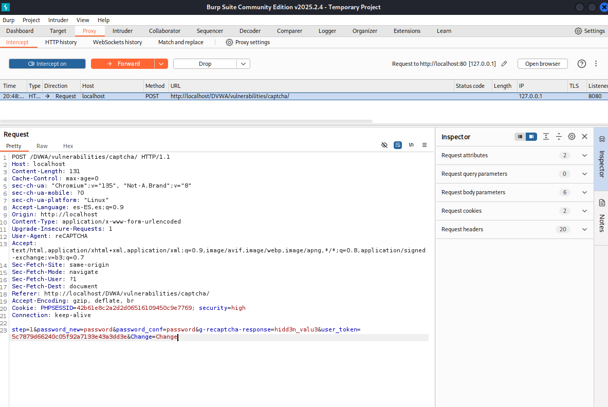
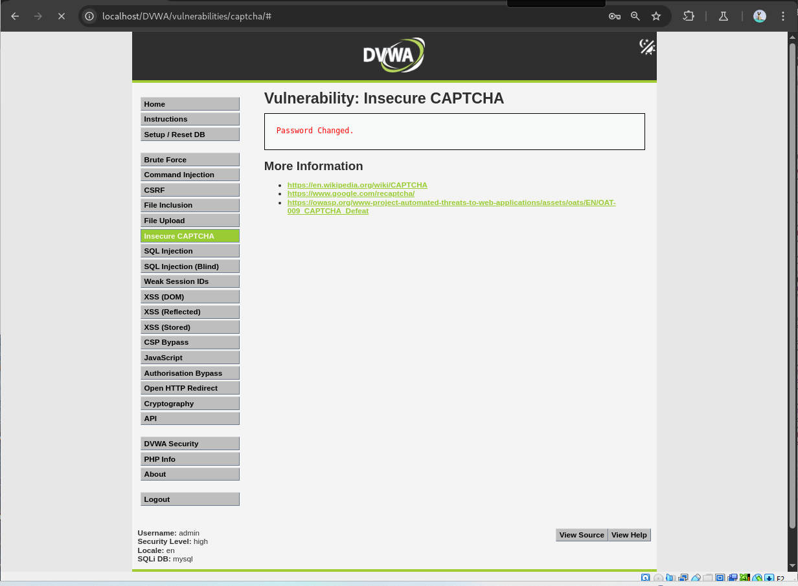

# Vulnerabilidad de Insecure CAPTCHA - Nivel Alto

Este README describe brevemente la vulnerabilidad de Insecure CAPTCHA y cómo explotarla en el nivel de seguridad Alto.

## Resumen de la Vulnerabilidad de Insecure CAPTCHA

La vulnerabilidad de Insecure CAPTCHA ocurre cuando un sistema CAPTCHA diseñado para distinguir humanos de bots tiene fallos de seguridad que permiten explotarlo fácilmente. Estos fallos pueden incluir validaciones insuficientes en el servidor o comprobaciones manipulables en el cliente.

## Explotación de Insecure CAPTCHA - Nivel de Seguridad Alto

### Análisis de las Validaciones

En el nivel de seguridad Alto, el sistema primero intenta verificar la respuesta de reCAPTCHA. Si esta falla, realiza una validación alternativa: comprueba si el parámetro `g-recaptcha-response` contiene la cadena `hidd3n_valu3` y si la cabecera `User-Agent` es `reCAPTCHA`.

### Bypassing las Validaciones

Para evitar la necesidad de resolver el reCAPTCHA, se pueden manipular los parámetros y la cabecera de la petición HTTP.

### Pasos para la Explotación

1.  **Interceptar la petición:** Utiliza una herramienta como Burp Suite para interceptar la petición web antes de enviarla.

2.  **Manipular los parámetros:**
    * Asegúrate de que el parámetro `g-recaptcha-response` incluya la cadena `hidd3n_valu3`. Puedes añadirla al valor existente o establecerla directamente.
3.  **Modificar la cabecera:**
    * Cambia el valor de la cabecera `User-Agent` a `reCAPTCHA`.

4.  **Enviar la petición modificada:** Envía la petición alterada al servidor.

### Resultado

Al cumplir con las condiciones de la validación alternativa (el valor específico en `g-recaptcha-response` y la cabecera `User-Agent`), se evita la verificación del reCAPTCHA, permitiendo completar la operación sin resolverlo.

En resumen, la explotación en el nivel Alto implica evitar la validación principal del reCAPTCHA manipulando el parámetro `g-recaptcha-response` para incluir `hidd3n_valu3` y estableciendo la cabecera `User-Agent` a `reCAPTCHA`.