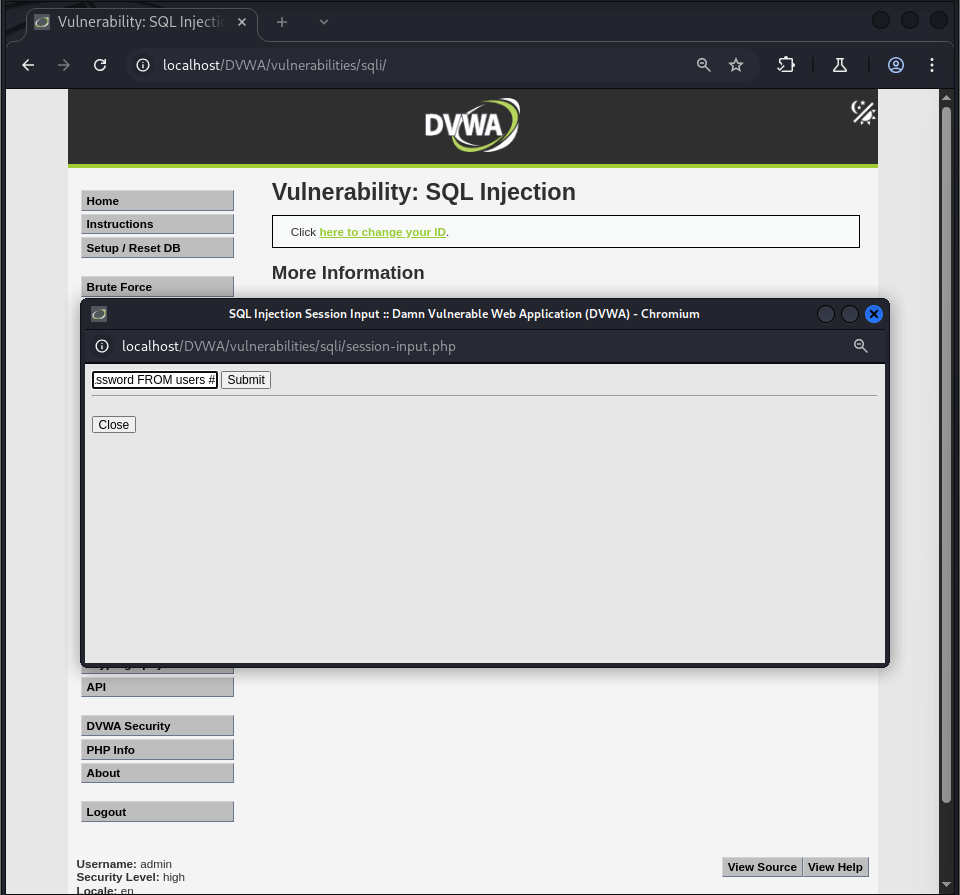
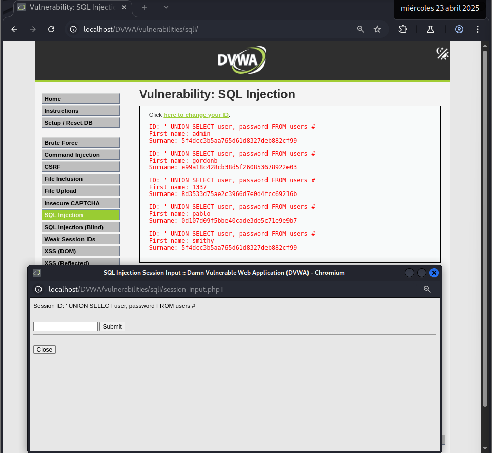

# Vulnerabilidad de SQL Injection - Nivel Alto

Este README describe brevemente la vulnerabilidad de SQL Injection y cómo explotarla en el nivel de seguridad Alto.

## Resumen de la Vulnerabilidad de SQL Injection

SQL Injection es una vulnerabilidad de seguridad que permite a los atacantes interferir con las consultas que una aplicación realiza a su base de datos. Al insertar código SQL malicioso en los campos de entrada de la aplicación (como formularios o parámetros en la URL), un atacante puede ejecutar comandos SQL no autorizados. Esto puede resultar en el acceso, la modificación o la eliminación de datos sensibles almacenados en la base de datos.

## Explotación de SQL Injection Paso a Paso:

Basándonos en los ejemplos del texto, la explotación de SQL Injection se centra en manipular las entradas de la aplicación para inyectar código SQL malicioso.

### Nivel de Seguridad Alto:

#### Identificar el punto de entrada alternativo:
En este nivel, la vulnerabilidad se encuentra en la posibilidad de modificar la `session ID`.

#### Acceder a la funcionalidad de modificación del ID de sesión:
La aplicación proporciona un enlace para cambiar el ID de sesión en una nueva ventana.

#### Inyectar código SQL malicioso en el ID de sesión:
En la nueva ventana, se puede inyectar el payload SQL directamente en el campo del ID de sesión, por ejemplo:
```
sql
' UNION SELECT user, password FROM users #
```


#### Enviar el ID de sesión modificado:
Al enviar el nuevo ID de sesión, la aplicación utiliza este valor en una consulta SQL para la tabla users.

#### Visualizar el resultado:
La respuesta del servidor mostrará la información obtenida a través de la inyección SQL, como los nombres de usuario y las contraseñas.



En resumen, la explotación en el nivel Alto se centra en evitar las protecciones tradicionales inyectando código SQL directamente en el parámetro session ID a través de la funcionalidad de modificación proporcionada por la aplicación.