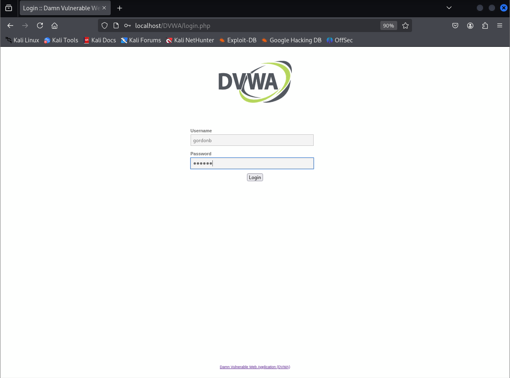
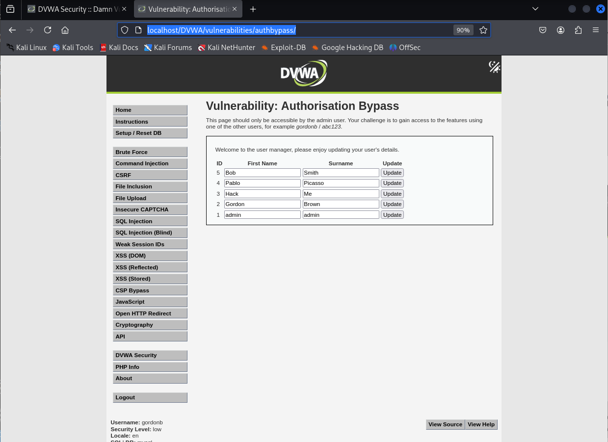

# Explotación de Authorisation Bypass - Nivel Bajo en DVWA

Este README describe brevemente cómo explotar una vulnerabilidad de Authorisation Bypass en el nivel de seguridad Bajo del laboratorio web DVWA (Damn Vulnerable Web Application).

## Pasos para la Explotación

1.  **Iniciar sesión como usuario no administrador:** Utiliza un conjunto de credenciales de un usuario normal para acceder a la aplicación DVWA. Por ejemplo, puedes usar el nombre de usuario `gordonb` y la contraseña `abc123`.



2.  **Intentar acceso directo:** Una vez que hayas iniciado sesión como usuario no administrador, abre una nueva pestaña o ventana en tu navegador web. En la barra de direcciones, intenta acceder directamente al directorio que debería estar restringido únicamente para usuarios administradores. La URL a la que debes intentar acceder es:

    ```
    /vulnerabilities/authbypass/
    ```

3.  **Verificar el acceso:** Después de ingresar la URL y presionar Enter, observa la respuesta del servidor. En este nivel de seguridad, la aplicación vulnerable permitirá el acceso al directorio `/vulnerabilities/authbypass/` **incluso si has iniciado sesión como un usuario sin privilegios de administrador**.



## Resultado de la Explotación

El acceso exitoso al directorio `/vulnerabilities/authbypass/` demuestra una vulnerabilidad de **Insecure Direct Object Reference (IDOR)**. Esta vulnerabilidad permite a usuarios no autorizados explotar los mecanismos de control de acceso e interactuar con funcionalidades o acceder a información que debería estar restringida a roles con mayores privilegios, como los administradores. En este caso específico, un usuario normal puede acceder a la página destinada a la funcionalidad de Authorisation Bypass, lo cual no debería ser posible.