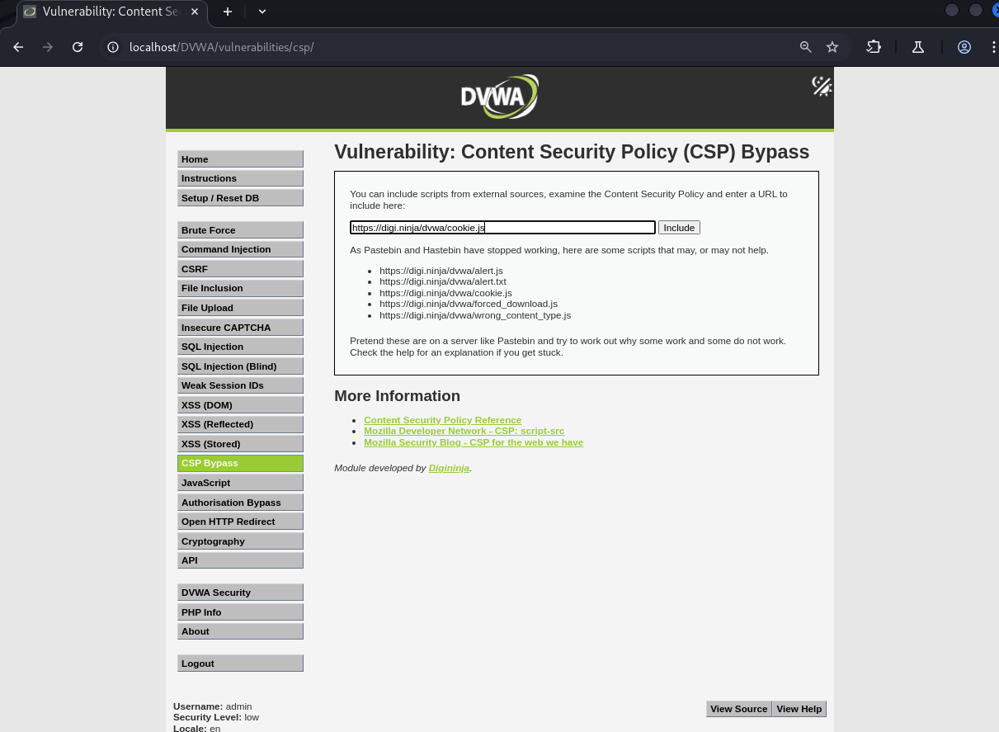
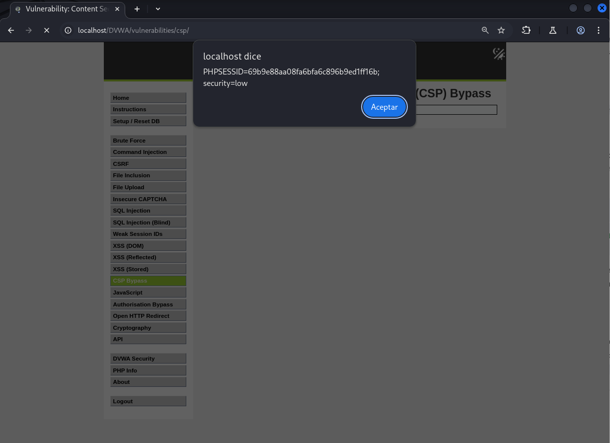

# Explotación de la CSP - Nivel de Seguridad Bajo

Este README describe brevemente la explotación de la Content Security Policy (CSP) en el nivel de seguridad bajo de una aplicación web vulnerable.

## Nivel de Seguridad Bajo

**Análisis de la CSP:**

Al inspeccionar las cabeceras de respuesta HTTP con Burp Suite o las herramientas de desarrollo del navegador, se observa que la CSP **no permite** la ejecución de scripts desde `https://pastebin.com`.

**Explotación:**

La vulnerabilidad se explota incluyendo un script desde un dominio permitido por la CSP. En este caso, se utiliza la URL `https://digi.ninja/dvwa/cookie.js`, que contiene un script que muestra la ID de la cookie a través de una alerta.

**Pasos para la Explotación:**

1.  En el campo de entrada proporcionado en la página del desafío, introduce la siguiente URL:

    ```
    [https://digi.ninja/dvwa/cookie.js](https://digi.ninja/dvwa/cookie.js)
    ```


2.  Haz clic en el botón "Include" o similar.

**Resultado:**

El script se cargará y ejecutará desde `digi.ninja` (un sitio web permitido por la CSP), mostrando una alerta con la información de la cookie de sesión. Esto demuestra cómo se puede explotar una CSP débil al utilizar fuentes de script permitidas para inyectar código malicioso.

