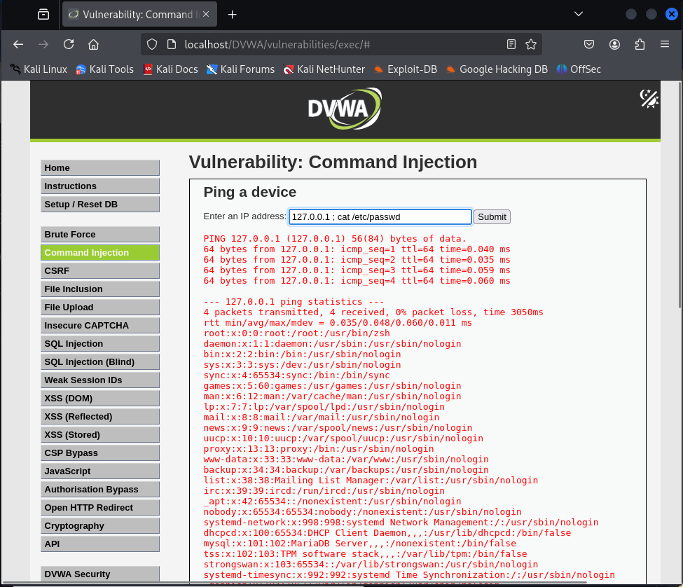
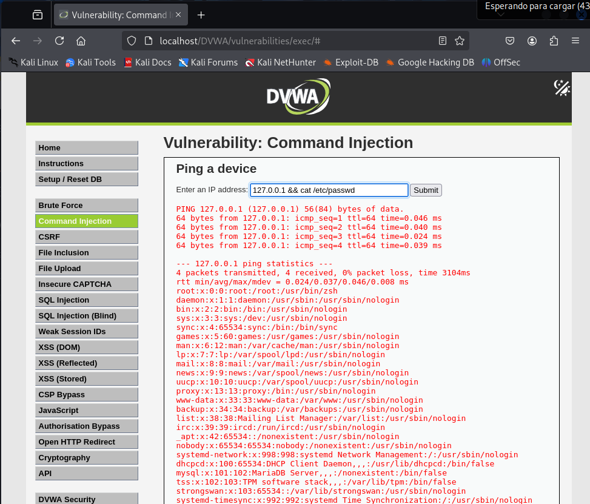

# Vulnerabilidad Command Injection - Nivel Bajo (DVWA)

Este documento describe la vulnerabilidad de Command Injection y cómo explotarla en el nivel de seguridad **Bajo** de la aplicación web Damn Vulnerable Web Application (DVWA).

**Descripción de la Vulnerabilidad Command Injection**

La vulnerabilidad de Command Injection ocurre cuando una aplicación web permite que un atacante ejecute comandos arbitrarios en el sistema operativo del servidor debido a una incorrecta sanitización de la entrada del usuario. Al inyectar comandos maliciosos a través de los parámetros de entrada, un atacante puede lograr acciones no autorizadas como:

* Ejecución de comandos del sistema.
* Acceso a información sensible.
* Modificación de archivos.
* Compromiso total del servidor.

**Nivel de Seguridad Bajo - Explotación**

En el nivel de seguridad Bajo de DVWA, la aplicación no implementa ninguna medida de seguridad significativa contra la inyección de comandos. El punto vulnerable en este nivel es el formulario que permite al usuario ingresar una dirección IP para realizar un ping.

**Pasos para la Explotación:**

1.  **Identificar el punto de entrada:** Localiza el campo donde la aplicación espera la entrada del usuario para realizar la acción (en este caso, el campo para la dirección IP).

2.  **Probar una inyección simple:** Ingresa una dirección IP válida seguida de un **punto y coma (`;`)** o el operador **doble ampersand (`&&`)**, y a continuación, el comando del sistema que deseas ejecutar.

    * **Ejemplo utilizando `;` (para sistemas Linux/Unix):**
        ```
        127.0.0.1 ; cat /etc/passwd
        ```
        Este payload intentará primero ejecutar el comando `ping 127.0.0.1` y luego, independientemente del resultado, ejecutará el comando `cat /etc/passwd` para mostrar el contenido del archivo de usuarios del sistema.



    * **Ejemplo utilizando `&&` (para sistemas Linux/Unix):**
        ```
        127.0.0.1 && cat /etc/passwd
        ```
        Este payload intentará primero ejecutar el comando `ping 127.0.0.1` y solo si este comando tiene éxito (devuelve un código de salida 0), se ejecutará el comando `cat /etc/passwd`.



3.  **Analizar el resultado:** Después de enviar la entrada modificada, observa la respuesta de la aplicación web. Si la inyección fue exitosa, la página mostrará el resultado del comando `ping` seguido del resultado del comando inyectado (en los ejemplos anteriores, el contenido del archivo `/etc/passwd`).

**Conclusión para el Nivel Bajo:**

El nivel de seguridad Bajo es altamente vulnerable a la inyección de comandos debido a la ausencia de cualquier tipo de validación o sanitización de la entrada del usuario. Los operadores de concatenación de comandos como `;` y `&&` permiten la ejecución de comandos arbitrarios en el sistema operativo del servidor.

**Advertencia:**

Este ejercicio se realiza en un entorno controlado como DVWA con fines educativos para comprender las vulnerabilidades de seguridad. **Nunca intentes explotar vulnerabilidades en sistemas que no te pertenecen.** El acceso no autorizado a sistemas informáticos es ilegal y puede tener graves consecuencias.
