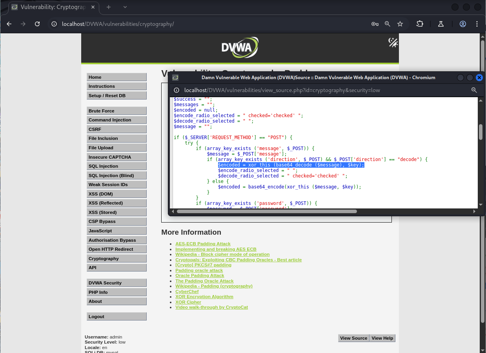
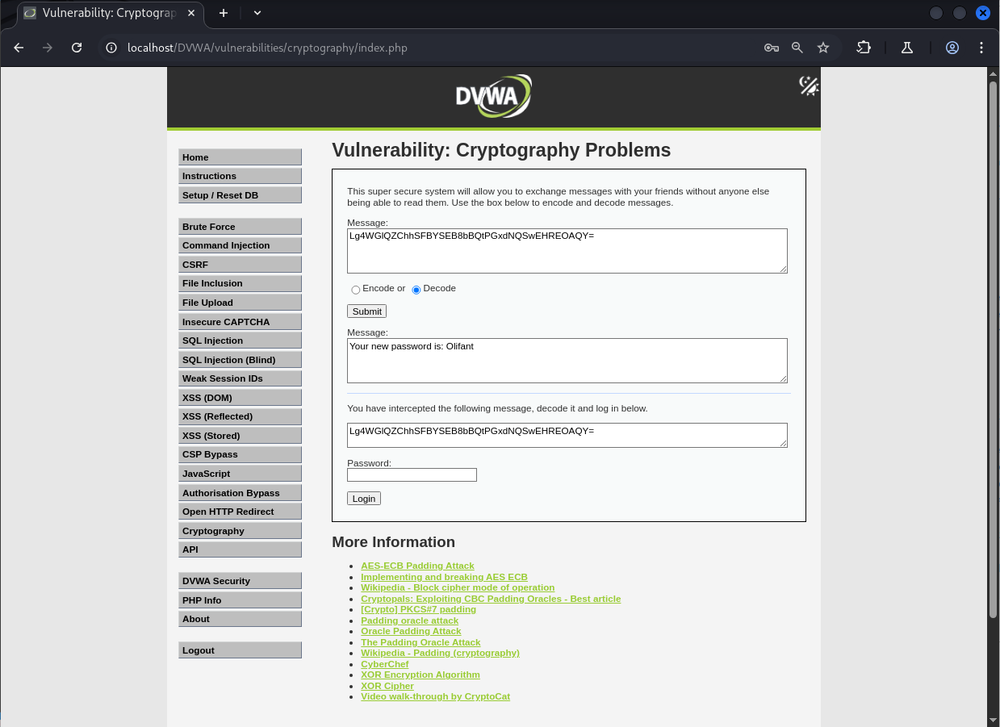
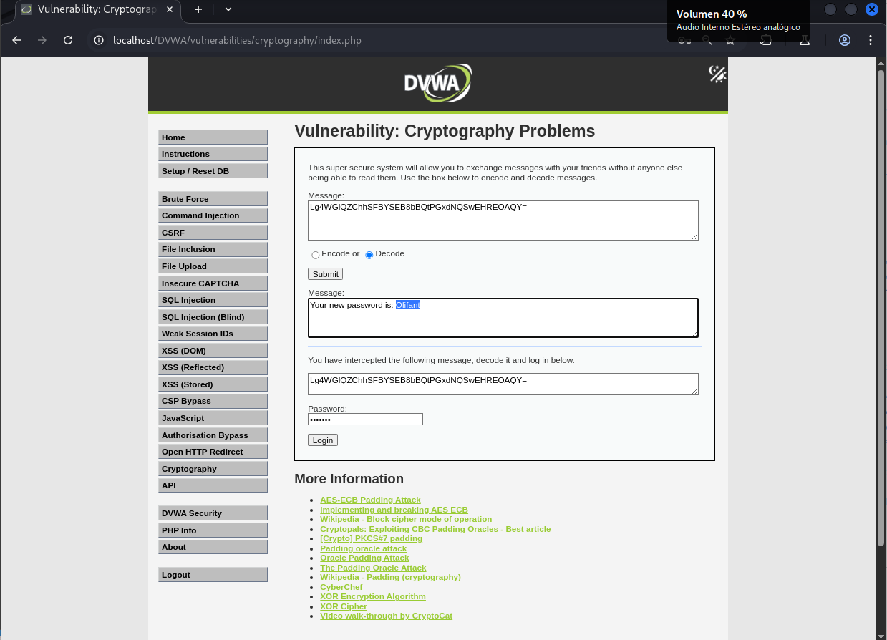
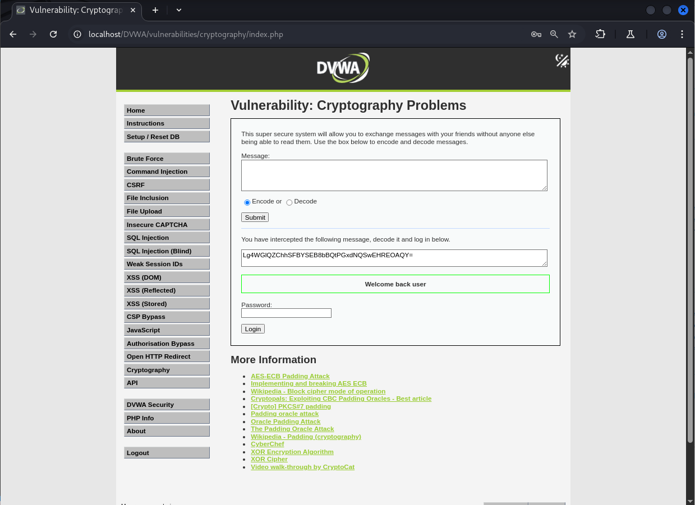

# Explotación de Cryptography en DVWA - Nivel Bajo

Este README describe brevemente cómo explotar la vulnerabilidad de criptografía en el nivel de seguridad Bajo del laboratorio web DVWA (Damn Vulnerable Web Application).

## Análisis de la Vulnerabilidad

En este nivel, la aplicación recibe un "Mensaje interceptado" que ha sido cifrado utilizando una operación XOR con una clave fija ("wachtwoord") y luego codificado en Base64. El proceso de "Decrypt" en la página realiza las operaciones inversas: primero decodifica la cadena Base64 y luego aplica la misma operación XOR con la clave para revelar el mensaje original, que en este caso es la contraseña.

## Pasos para la Explotación

1.  **Acceder a la sección de "Cryptography" en DVWA.**
2.  **Copiar el "Mensaje interceptado"** que se proporciona en el campo destinado al descifrado.
3.  **Pegar el "Mensaje interceptado" en el mismo campo de descifrado.**
4.  **Hacer clic en el botón "Decrypt".**

**Resultado:** La aplicación realizará la operación XOR con la clave "wachtwoord" y decodificará la cadena Base64, mostrando la contraseña original en el campo de texto descifrado.

## Obtención y Uso de la Contraseña

1.  **Copiar la contraseña resultante** del campo de texto descifrado.
2.  **Dirigirse al formulario de inicio de sesión de DVWA.**
3.  **Pegar la contraseña copiada** en el campo "Password".

4.  **Hacer clic en "Login".**

Serás autenticado exitosamente en la aplicación DVWA utilizando la contraseña obtenida mediante el descifrado del "Mensaje interceptado".

**Nota:** Esta vulnerabilidad se debe al uso de una clave de cifrado estática y un algoritmo simple como XOR, lo que facilita la recuperación del mensaje original.