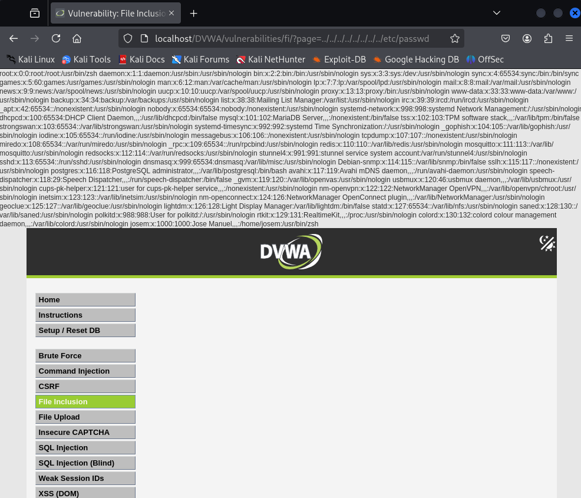

# Vulnerabilidad de File Inclusion - Nivel Bajo

Este directorio contiene ejemplos de explotación de la vulnerabilidad de File Inclusion en el nivel de seguridad bajo, basado en las configuraciones de Damn Vulnerable Web Application (DVWA).

## Resumen de Vulnerabilidades de File Inclusion

La vulnerabilidad de **File Inclusion** ocurre cuando una aplicación web permite que un usuario controle qué archivo se incluye o ejecuta dentro de la aplicación. Una validación insuficiente de la entrada del usuario puede permitir la inclusión de archivos inesperados, llevando a la exposición de información sensible o la ejecución remota de código.

Existen dos tipos principales:

* **Local File Inclusion (LFI):** Permite incluir archivos presentes en el servidor web.
* **Remote File Inclusion (RFI):** Permite incluir archivos desde un servidor remoto.

## Explotación LFI - Nivel de Seguridad Bajo

En el nivel de seguridad bajo de DVWA, el parámetro `page` en la URL es directamente utilizado para incluir archivos sin ninguna validación. Esto facilita la explotación de la vulnerabilidad LFI mediante la técnica de **path traversal**.

**Pasos para la Explotación:**

1.  **Identificar el parámetro vulnerable:** El parámetro `page` en la URL es vulnerable.

2.  **Manipular la URL con path traversal:** Utiliza la secuencia `../` para navegar a través de los directorios del servidor y acceder a archivos fuera de la ruta esperada.

3.  **Ejemplo para acceder a `/etc/passwd`:**

    Asumiendo que la aplicación se encuentra en `/var/www/html`, la siguiente URL permite intentar acceder al archivo `/etc/passwd`:
    
```
    http://<ip del servidor>/DVWA/vulnerabilities/fi/?page=../../../../../../../../etc/passwd
```

4.  **Verificar la inclusión:** Si la explotación es exitosa, el contenido del archivo `/etc/passwd` se mostrará en la respuesta de la página web.

**Nota:** Este nivel de seguridad es intencionalmente inseguro para demostrar la vulnerabilidad de forma clara. En entornos reales, las aplicaciones deberían implementar medidas de seguridad robustas para prevenir ataques de File Inclusion.


