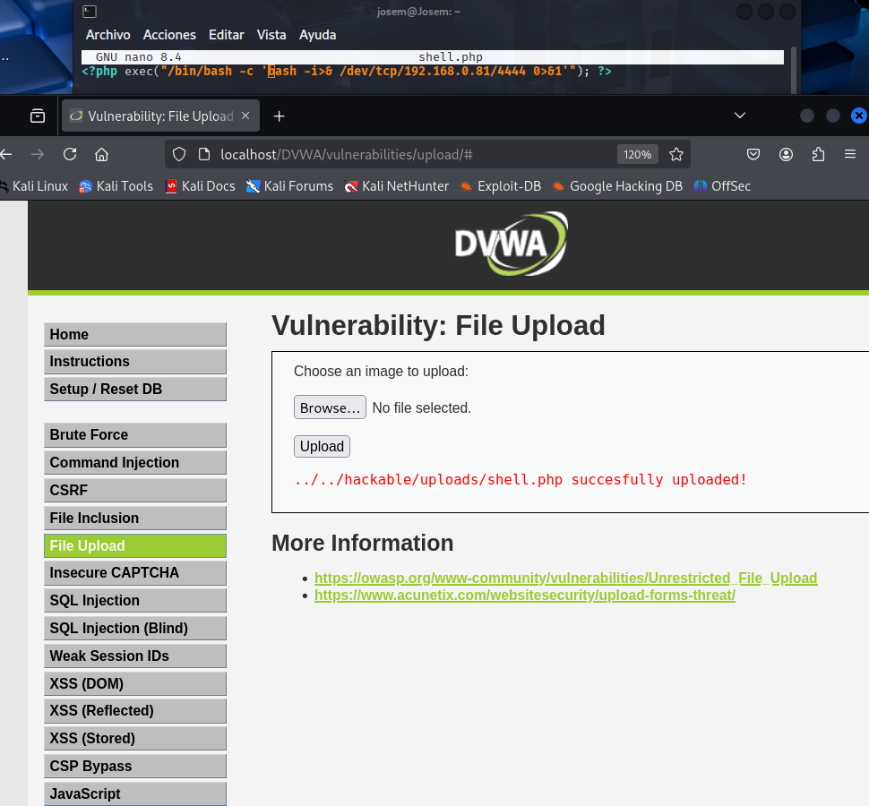
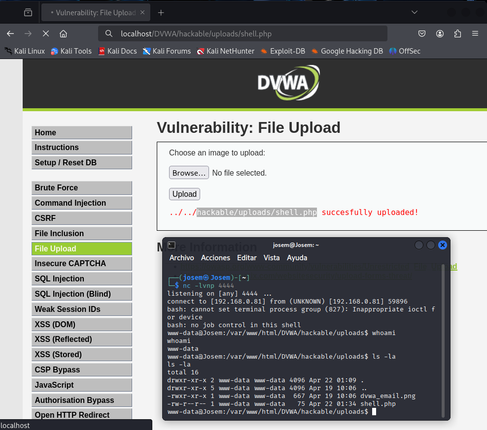

# Vulnerabilidad de File Upload - Nivel Bajo

Este README describe brevemente la vulnerabilidad de File Upload y cómo explotarla en el nivel de seguridad Bajo, basándonos en los ejemplos proporcionados.

## Resumen de la Vulnerabilidad de File Upload

La vulnerabilidad de File Upload ocurre cuando una aplicación web permite subir archivos sin validaciones adecuadas, permitiendo a atacantes subir y ejecutar archivos maliciosos en el servidor.

## Explotación de la Vulnerabilidad de File Upload - Nivel de Seguridad Bajo

### Identificación

Localizar la funcionalidad de carga de archivos en la aplicación web.

### Preparación del Archivo Malicioso

Crear un script PHP (ejemplo: `shell.php`) para establecer una reverse shell a la IP y puerto del atacante.

### Subida

Utilizar la funcionalidad de carga para subir el archivo `shell.php`. No hay validaciones, por lo que la subida es exitosa.



### Localización

El archivo se guarda en una ubicación predecible (ejemplo: `/hackable/uploads/`).

### Configuración del Listener

En la máquina del atacante, iniciar un listener Netcat:

```bash
nc -lvnp <puerto_especificado>
```


