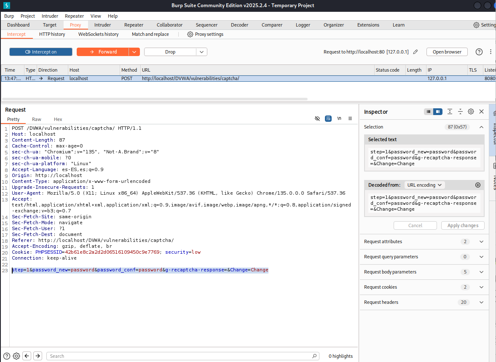
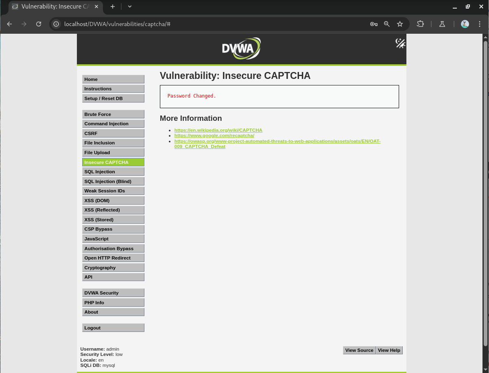

# Vulnerabilidad de Insecure CAPTCHA - Nivel Bajo

Este README describe brevemente la vulnerabilidad de Insecure CAPTCHA y cómo explotarla en el nivel de seguridad Bajo, basándonos en los ejemplos proporcionados.

## Resumen de la Vulnerabilidad de Insecure CAPTCHA

La vulnerabilidad de Insecure CAPTCHA ocurre cuando un sistema CAPTCHA diseñado para diferenciar humanos de bots tiene fallos de seguridad que permiten evitarlo fácilmente. Esto puede deberse a validaciones inadecuadas en el servidor o dependencias en comprobaciones del lado del cliente.

## Explotación de Insecure CAPTCHA - Nivel de Seguridad Bajo

### Entendiendo el Flujo y la Debilidad

El sistema en este nivel tiene dos pasos: verificar la entrada y el CAPTCHA (paso 1), y luego completar la operación (paso 2). La debilidad radica en que la aplicación espera que el paso 1 se complete antes del paso 2, pero no impone una verificación estricta en el servidor.

### Pasos para la Explotación

1.  **Interceptar la petición:** Utiliza una herramienta como Burp Suite para interceptar la petición web justo antes de hacer clic en "Submit" (el paso 2).
2.  **Manipular el parámetro `step`:** En la petición interceptada, localiza el parámetro llamado `step` y cambia su valor de `1` a `2`.

3.  **Enviar la petición modificada:** Envía la petición alterada al servidor.

### Resultado

Al enviarar la verificación del paso 1 manipulando el parámetro `step`, la operación (como el cambio de contraseña) se completa exitosamente sin necesidad de resolver el CAPTCHA.

En resumen, la explotación en el nivel Bajo se centra en evitar la lógica secuencial del lado del cliente manipulando un parámetro clave en la petición HTTP.