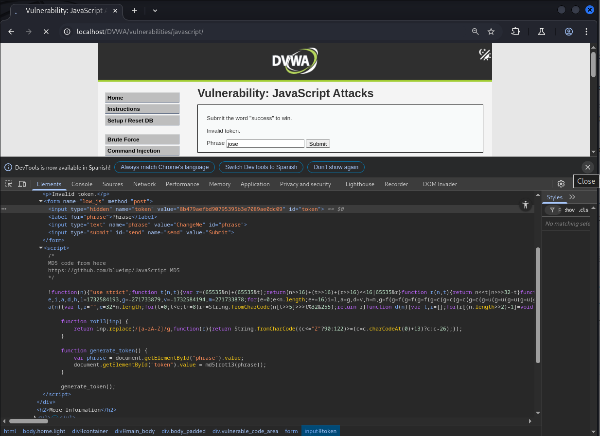
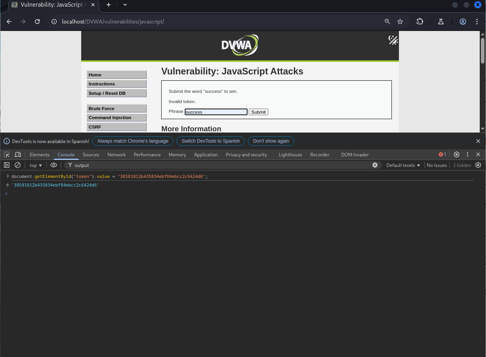
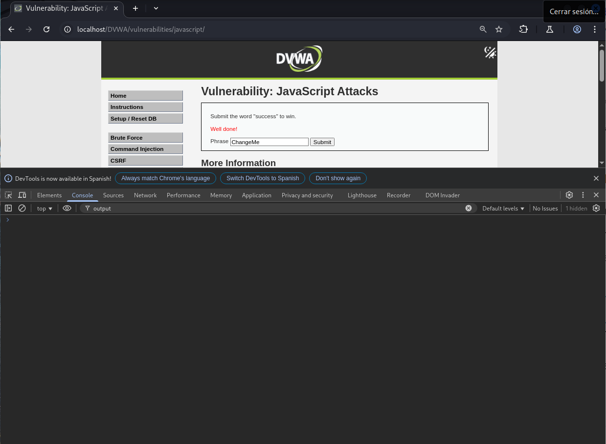

# Explotación de la Vulnerabilidad de Token Fijo en DVWA - Nivel Bajo

Este README describe brevemente cómo explotar una vulnerabilidad de token fijo en el nivel de seguridad Bajo del laboratorio web DVWA (Damn Vulnerable Web Application).

## Análisis del Código Fuente

Al analizar el código fuente del formulario, se observa lo siguiente:

* Existe un campo oculto llamado `token`.
* Una función JavaScript `generate_token()` se encarga de establecer el valor de este campo.

## Función `generate_token()`

La función `generate_token()` realiza las siguientes operaciones:

1.  Toma el valor del campo de entrada con el nombre `phrase`.
2.  Aplica la función de cifrado ROT13 a este valor.
3.  Calcula el hash MD5 del resultado de la operación ROT13.
4.  Asigna este hash MD5 al valor del campo oculto `token`.



## Pasos para la Explotación

1.  **Identificar el Texto Objetivo:** El objetivo es hacer que el servidor acepte la entrada. Basándonos en el contexto (aunque no se proporcione explícitamente aquí, en un escenario real se deduciría), asumimos que la palabra clave para el éxito es "success".

2.  **Aplicar ROT13 al Texto Objetivo:** Utiliza la función ROT13 para cifrar la palabra "success":

    ```bash
    rot13("success") = "fhpprff"
    ```

3.  **Calcular el Hash MD5 del Resultado ROT13:** Calcula el hash MD5 de la cadena "fhpprff". Puedes usar una herramienta online o la consola de desarrollador de tu navegador:

    ```bash
    md5("fhpprff") = "38581812b435834ebf84ebcc2c6424d6"
    ```

4.  **Manipular el Campo `token`:** Abre la consola de desarrollador de tu navegador (por ejemplo, presionando F12). Introduce el siguiente código JavaScript y presiona Enter para modificar el valor del campo oculto `token`:

    ```javascript
    document.getElementById("token").value = "38581812b435834ebf84ebcc2c6424d6";
    ```


5.  **Enviar el Formulario:** Sin modificar el campo de texto principal (o asegurándote de que contenga la palabra clave esperada, como "success" en este contexto), envía el formulario.



## Resultado

Al enviar el formulario con el valor del campo `token` manipulado al hash MD5 del ROT13 de la palabra clave esperada, la validación del servidor se efectuará, lo que resultará en un mensaje de éxito o la acción esperada de la aplicación. Esto demuestra una vulnerabilidad donde el token de seguridad no es verdaderamente aleatorio o único por sesión.