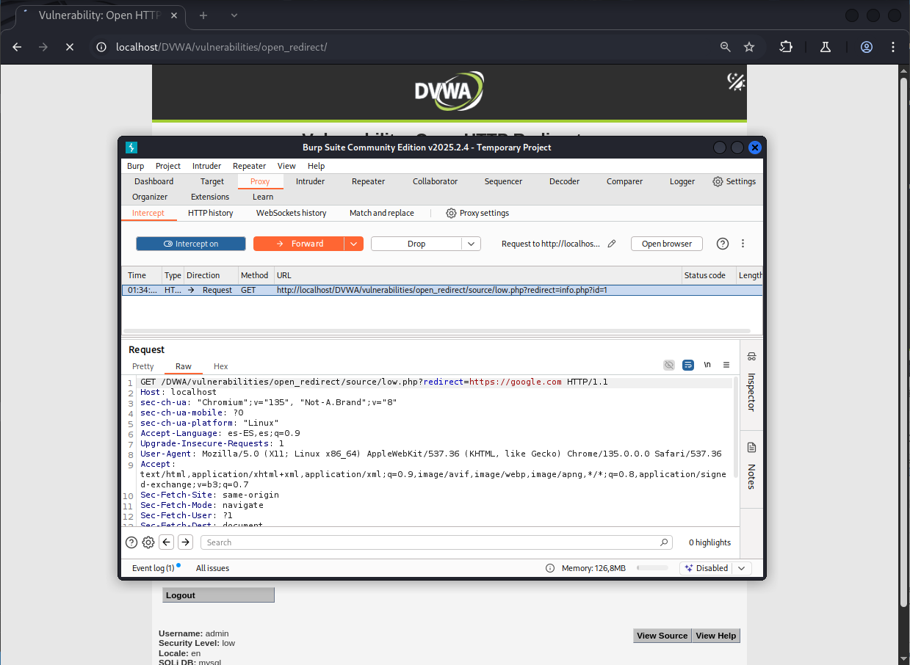
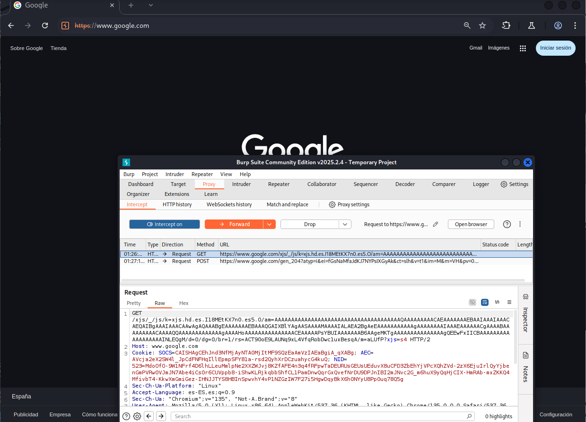

# Explotación de Open HTTP Redirect - Nivel Bajo (DVWA)

Este README describe brevemente cómo explotar la vulnerabilidad de Open HTTP Redirect en el nivel de seguridad Bajo del laboratorio web DVWA (Damn Vulnerable Web Application) utilizando Burp Suite.

## Análisis de la Vulnerabilidad

En el nivel Bajo, la página de redirección (`/vulnerabilities/redirect/`) no realiza ninguna validación sobre la URL de destino proporcionada en el parámetro `redirect`. Esto permite a un atacante redirigir a los usuarios a sitios web maliciosos o no deseados.

## Pasos para la Explotación con Burp Suite

1.  **Identificar el Parámetro de Redirección:**
    * Accede a la página de redirección en DVWA (normalmente `/DVWA/vulnerabilities/redirect/`).
    * Haz clic en uno de los enlaces proporcionados. Observa la URL en la barra de direcciones de tu navegador. Deberías ver un parámetro llamado `redirect` con una URL como valor. Por ejemplo:
        ```
        http://<IP_del_servidor>/DVWA/vulnerabilities/redirect/?redirect=http://localhost/DVWA/
        ```

2.  **Configurar Burp Suite:**
    * Asegúrate de que Burp Suite esté configurado para interceptar el tráfico de tu navegador.

3.  **Interceptar la Petición:**
    * Vuelve a hacer clic en uno de los enlaces de redirección en la página de DVWA.
    * Burp Suite interceptará la petición GET enviada al servidor. Busca la petición a `/DVWA/vulnerabilities/redirect/`.
    * En la pestaña "Proxy" -> "HTTP history" o en la pestaña "Intercept" si la intercepción está activa, verás la petición con el parámetro `redirect`.

4.  **Modificar el Parámetro `redirect`:**
    * En la vista del interceptor o en la pestaña "Request" dentro del "HTTP history", localiza el parámetro `redirect` en la URL.
    * Modifica el valor de este parámetro a la URL a la que deseas redirigir a la víctima. Por ejemplo, para redirigir a Google:
        ```
        redirect=[https://www.google.com](https://www.google.com)
        ```
    * La URL completa modificada en la petición se verá similar a:
        ```
        GET /DVWA/vulnerabilities/redirect/?redirect=[https://www.google.com](https://www.google.com) HTTP/1.1
        Host: <IP_del_servidor>
        ...
        ```


5.  **Enviar la Petición Modificada:**
    * Si estás en la pestaña "Intercept", haz clic en el botón "Forward" para enviar la petición modificada al servidor.
    * Si modificaste la petición en el "HTTP history", puedes hacer clic derecho en la petición y seleccionar "Replay request" y luego "Send". Alternativamente, puedes copiar la URL modificada y pegarla directamente en la barra de direcciones de tu navegador.



## Resultado de la Explotación

El servidor procesará la petición con el parámetro `redirect` modificado y enviará una respuesta HTTP con un código de estado 302 (Found) o similar, junto con una cabecera `Location` que contiene la URL especificada en el parámetro `redirect` (en este caso, `https://www.google.com`). El navegador del usuario seguirá esta redirección y será llevado al sitio web de Google.

En resumen, en el nivel Bajo, la explotación es sencilla y directa mediante la manipulación del parámetro `redirect` a través de Burp Suite o directamente en la URL.