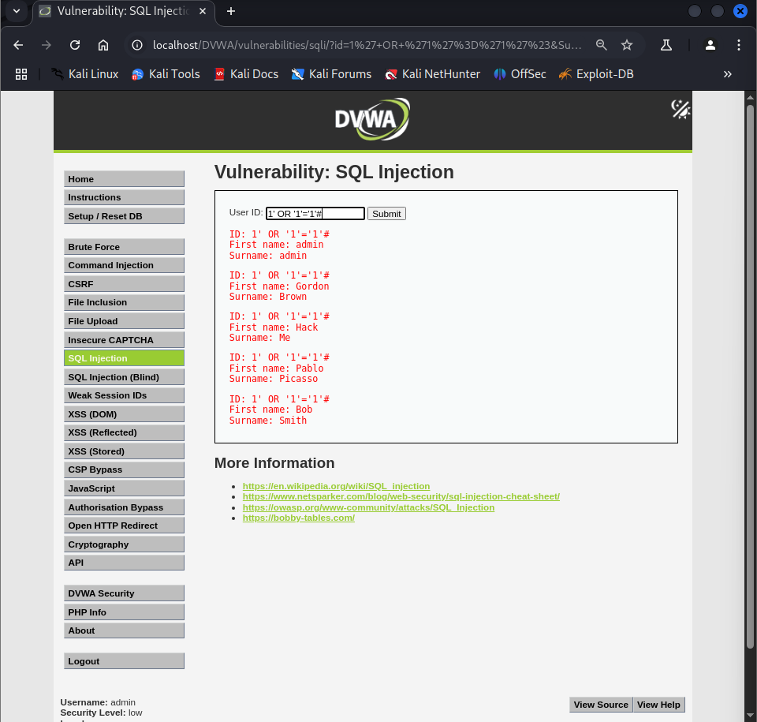

# Vulnerabilidad de SQL Injection - Nivel Bajo

Este README describe brevemente la vulnerabilidad de SQL Injection y cómo explotarla en el nivel de seguridad Bajo.
## Resumen de la Vulnerabilidad de SQL Injection

SQL Injection es una vulnerabilidad de seguridad que permite a los atacantes interferir con las consultas que una aplicación realiza a su base de datos. Al insertar código SQL malicioso en los campos de entrada de la aplicación (como formularios o parámetros en la URL), un atacante puede ejecutar comandos SQL no autorizados. Esto puede resultar en el acceso, la modificación o la eliminación de datos sensibles almacenados en la base de datos.

## Explotación de SQL Injection Paso a Paso:

La explotación de SQL Injection se centra en manipular las entradas de la aplicación para inyectar código SQL malicioso.

### Nivel de Seguridad Bajo:

#### Identificar el punto de entrada:
En este nivel, el punto de entrada es el campo ID que se envía a través de un formulario (probablemente mediante el método GET o POST).

#### Entender la consulta SQL vulnerable:
La aplicación toma el valor del ID directamente y lo inserta en una consulta SQL sin validación. Una consulta típica podría ser algo como:
```
sql
SELECT first_name, last_name FROM users WHERE id = '$id';
```
#### Inyectar código SQL malicioso:
El objetivo es modificar esta consulta para realizar acciones no deseadas.

#### Uso de la condición WHERE para mostrar todos los usuarios:
El payload ` 1' OR '1'='1'# ` se inserta en el campo ID. La consulta resultante se convierte en:
```
SELECT first_name, last_name FROM users WHERE id = '1' OR '1'='1'#';
```



La condición '1'='1' siempre es verdadera, por lo que la cláusula WHERE se vuelve siempre cierta y devuelve todas las filas de la tabla users. El # se utiliza para comentar el resto de la consulta original, evitando errores de sintaxis.