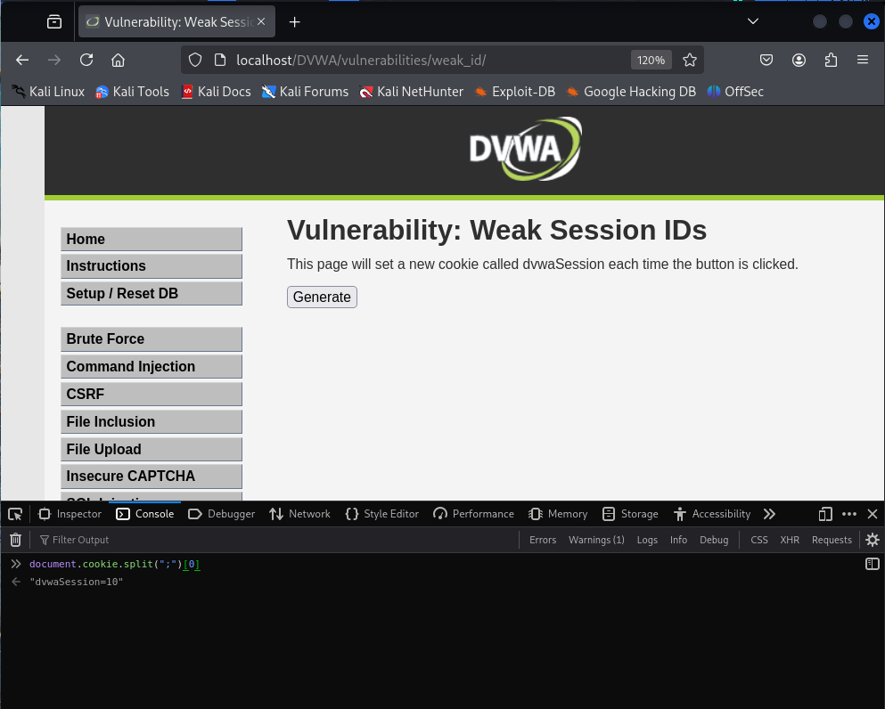

# Explotación de la Vulnerabilidad Weak ID (Nivel Bajo)

Este repositorio documenta el proceso de explotación de la vulnerabilidad "Weak ID" en una aplicación web vulnerable, utilizando como ejemplo la página `/dvwa/vulnerabilities/weak_id/` del entorno DVWA (Damn Vulnerable Web Application).

## Descripción de la Vulnerabilidad

La vulnerabilidad "Weak ID" ocurre cuando los identificadores utilizados por una aplicación (en este caso, un ID de sesión almacenado en una cookie) se generan de manera predecible. Si la lógica de generación es simple, como un contador secuencial, un atacante podría inferir o incluso intentar utilizar los IDs de otros usuarios.

## Pasos para la Explotación (Nivel Bajo)

Esta guía describe cómo analizar y explotar una implementación básica de la vulnerabilidad Weak ID, donde el ID de sesión se incrementa secuencialmente con cada interacción.

**1. Inspeccionar las Cookies:**

   - Abre la página de la vulnerabilidad Weak ID en tu navegador (ejemplo: `/DVWA/vulnerabilities/weak_id/`).
   - Abre la consola de desarrollador de tu navegador (Ctrl + Shift + K en Firefox, Cmd + Option + K en macOS, o la herramienta equivalente en otros navegadores).
   - Navega a la pestaña "Almacenamiento" o "Storage" (la denominación puede variar).
   - Dentro de la sección de "Cookies" o "Almacenamiento Local", localiza la cookie llamada `dvwaSession`.

**2. Analizar el Valor Inicial de la Cookie:**

   - Observa el valor inicial de la cookie `dvwaSession` al cargar la página por primera vez o después de un tiempo de inactividad. Generalmente, este valor suele ser `1`.

**3. Interactuar con la Funcionalidad "Generate":**

   - En la página de Weak ID, busca y haz clic en el botón etiquetado como "Generate".

**4. Observar la Modificación de la Cookie:**

   - Vuelve a la consola de desarrollador y actualiza la vista de las cookies (en algunos navegadores, la actualización es automática).
   - Nota cómo el valor de la cookie `dvwaSession` ha cambiado. Después del primer clic en "Generate", el valor se incrementará a `2`.

**5. Repetir la Interacción:**

   - Haz clic en el botón "Generate" varias veces más.
   - Observa cómo el valor de la cookie `dvwaSession` se incrementa en `1` con cada clic sucesivo (por ejemplo, `3`, `4`, `5`, etc.).

**6. Inferir la Lógica de Generación del ID:**

   - Basándote en las observaciones anteriores, puedes inferir que la lógica de generación del ID de sesión (`dvwaSession`) en este nivel bajo es simplemente un contador que comienza en `1` y se incrementa en `1` cada vez que se interactúa con la funcionalidad "Generate".

**7. Inferir IDs de Otros Usuarios (Teóricamente):**

   - En un escenario real con múltiples usuarios, si el sistema generara los IDs de sesión de manera similar (un contador global), un atacante podría intentar inferir los IDs de otros usuarios.
   - Por ejemplo, si tu `dvwaSession` llega a `4` y luego, después de un tiempo o una posible acción de otro usuario, ves que vuelve a `6`, podrías deducir (teóricamente) que otro usuario tiene o tuvo una sesión con el `dvwaSession` con el valor `5`.

## Conclusión

La explotación de la vulnerabilidad Weak ID en este nivel bajo demuestra cómo una lógica de generación de identificadores simple y predecible puede permitir a un atacante inferir potencialmente los IDs de otros usuarios. En sistemas reales, esto podría llevar a ataques de suplantación de identidad si los IDs de sesión no se protegen adecuadamente.

**Importante:** Este ejercicio se realiza en un entorno controlado y vulnerable (DVWA) con fines educativos. Nunca intentes explotar vulnerabilidades en sistemas que no te pertenezcan o para los que no tengas permiso.