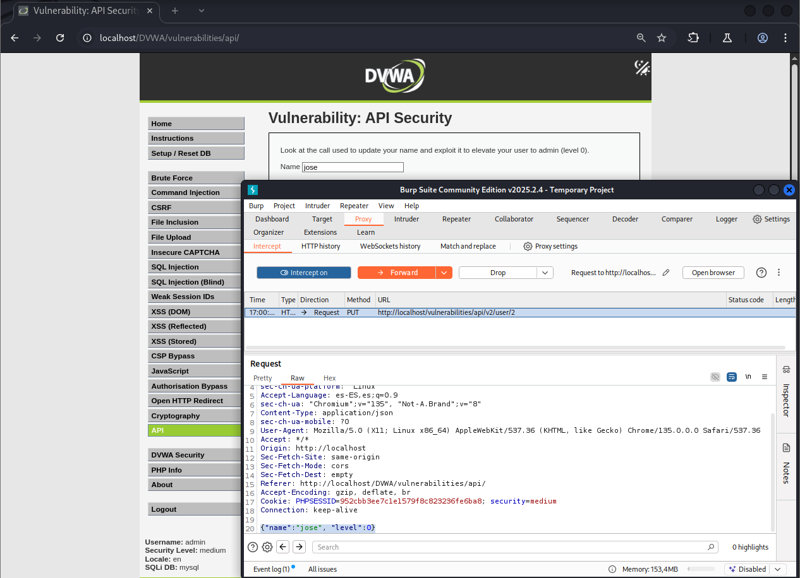

# Explotación de Authorisation Bypass mediante API - Nivel Medio

Este README describe brevemente cómo explotar una vulnerabilidad de elusión de autorización mediante una API en el nivel Medio. La aplicación expone una API para gestionar los privilegios de usuario, pero el nivel de privilegios se establece mediante un parámetro manipulable en la solicitud, sin validación adecuada en el servidor.

## Pasos para la Explotación

1.  **Interceptar la petición:** Utiliza Burp Suite para interceptar la petición PUT enviada al añadir un nombre de usuario (por ejemplo, "testUser") en el formulario.

2.  **Analizar la estructura de la petición:** Observa el cuerpo de la petición en Burp Suite. Debería contener el nombre del usuario y su nivel de privilegio actual. Por ejemplo:

    ```json
    {"name": "testUser", "level": 1}
    ```

3.  **Modificar el nivel de privilegio:** En el cuerpo de la petición interceptada, modifica el valor del parámetro `"level"` a `0` (o cualquier otro valor que represente privilegios de administrador según la lógica de la aplicación). La petición modificada podría verse así:

    ```json
    {"name": "testUser", "level": 0}
    ```


4.  **Reenviar la petición:** Envía la petición modificada al servidor a través de Burp Suite.

5.  **Verificar la elevación de privilegios:** Observa la respuesta del servidor en Burp Suite. Debería indicar que el nivel de privilegios del usuario se ha actualizado a administrador. Al volver a la aplicación y consultar los privilegios del usuario "testUser", este debería mostrar ahora privilegios de administrador.

## Resumen de la Vulnerabilidad

La elusión de autorización en este nivel se logra manipulando directamente el parámetro que define el nivel de privilegios en la petición a la API. El servidor no realiza una validación adecuada para verificar si el usuario autenticado tiene permiso para modificar el nivel de privilegios de otro usuario, lo que permite una elevación de privilegios no autorizada.