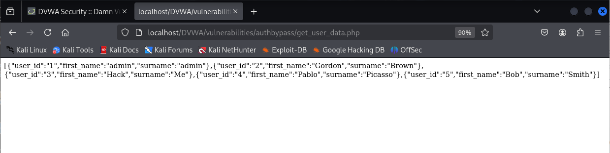

# Explotación de Authorisation Bypass - Nivel Medio en DVWA

Este README describe brevemente la explotación de una vulnerabilidad de Authorisation Bypass en el nivel de seguridad Medio del laboratorio web DVWA (Damn Vulnerable Web Application).

## Análisis del Comportamiento

En este nivel, el acceso directo al directorio `/vulnerabilities/authbypass/` está restringido para usuarios que no tienen privilegios de administrador. Sin embargo, la página principal se alimenta de datos de usuario obtenidos del script `/vulnerabilities/authbypass/get_user_data.php`.

## Explotación mediante IDOR

La elusión de la autorización se logra mediante una vulnerabilidad de Insecure Direct Object Reference (IDOR). Al acceder directamente al script que proporciona los datos, en lugar de intentar acceder al directorio protegido, se puede sortear la restricción.

**Pasos para la Explotación:**

1.  **Iniciar sesión como usuario no administrador:** Utiliza las credenciales de un usuario con privilegios normales. Por ejemplo: `gordonb` / `abc123`.


2.  **Acceder directamente al archivo de datos:** En tu navegador, intenta acceder directamente al siguiente archivo:

    ```
    http://<IP_del_servidor>/DVWA/vulnerabilities/authbypass/get_user_data.php
    ```

    **Nota:** Reemplaza `<IP_del_servidor>` con la dirección IP de tu servidor DVWA.



## Resultado de la Explotación

Si la aplicación no implementa una verificación de autorización adecuada en el script `get_user_data.php`, el usuario no administrador (en este caso, `gordonb`) podrá acceder a los datos de usuario que deberían estar restringidos únicamente a los administradores. Esto demuestra una vulnerabilidad IDOR donde la falta de validación de permisos en el acceso directo al recurso permite superar la restricción de acceso al directorio.