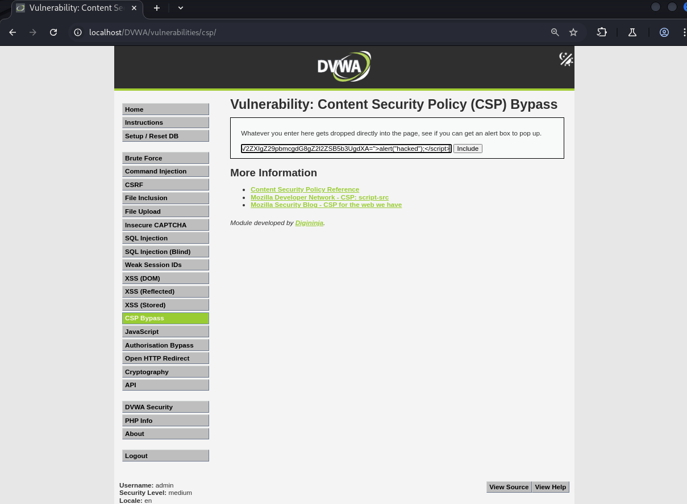
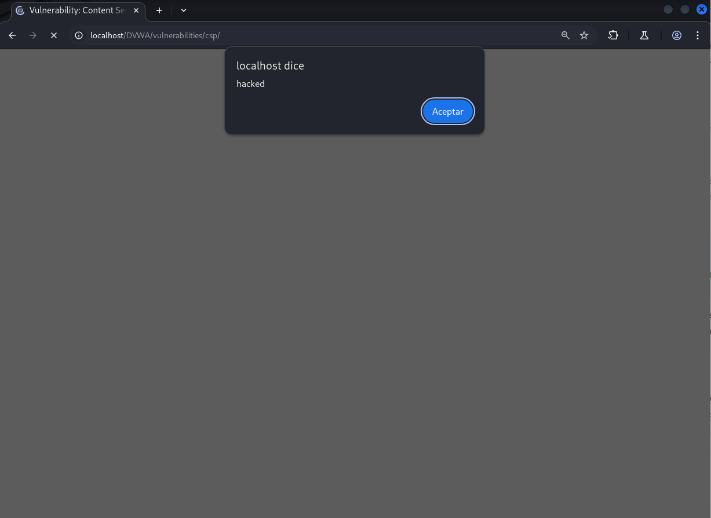

# Explotación de la CSP en Nivel de Seguridad Medio

Este readme describe cómo explotar una configuración de Content Security Policy (CSP) de nivel de seguridad medio.

## Nivel de Seguridad Medio

**Análisis de la CSP:**

La cabecera `Content-Security-Policy` permite scripts de `'self'`, `'unsafe-inline'` y scripts con un nonce específico: `nonce-TmV2ZXIgZ29pbmcgdG8gZ2l2ZSB5b3UgdXA=`.

**Vulnerabilidad:**

La vulnerabilidad reside en que el valor del nonce se mantiene constante en cada petición, lo que permite evitar la protección.

**Explotación:**

Para explotar la CSP, se puede inyectar una etiqueta `<script>` que incluya el atributo `nonce` con el valor conocido.

**Pasos para la Explotación:**

1.  En el campo de entrada proporcionado en la página del desafío, introduce el siguiente código HTML:

    ```html
    <script nonce="TmV2ZXIgZ29pbmcgdG8gZ2l2ZSB5b3UgdXA=">alert("hacked");</script>
    ```


2.  Haz clic en el botón "Include" o similar para que el código se procese.

3.  El navegador reconocerá el nonce válido y ejecutará el script `alert("hacked");`, demostrando la explotación de la CSP.



**Conclusión:**

La reutilización de un nonce estático en la directiva CSP permite a un atacante inyectar scripts maliciosos evitando las restricciones de seguridad. Para una protección robusta, el valor del nonce debe ser único y generado dinámicamente en cada respuesta del servidor.