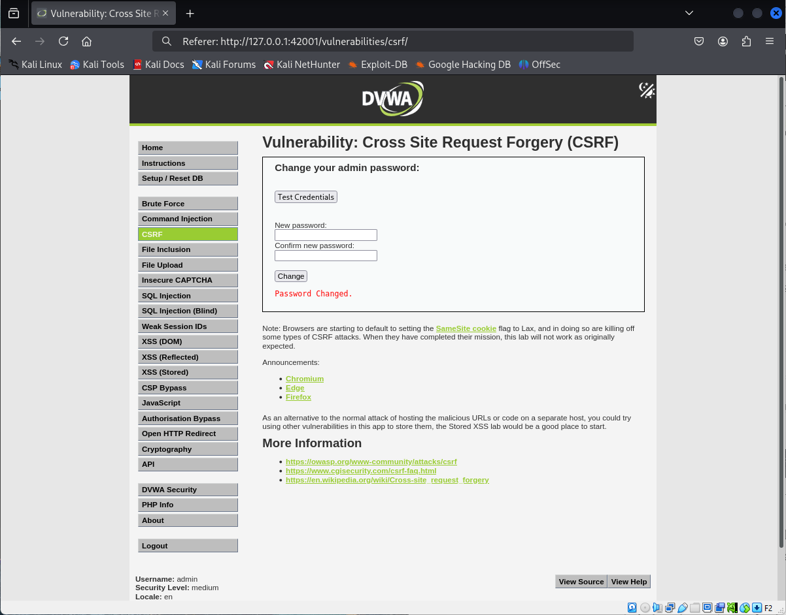

# Explotación de Vulnerabilidad CSRF - Nivel Medio (DVWA)

Este documento describe brevemente la explotación de la vulnerabilidad Cross-Site Request Forgery (CSRF) en el nivel de seguridad "Medio" de la aplicación web vulnerable Damn Vulnerable Web Application (DVWA).

## Vulnerabilidad CSRF

CSRF ocurre cuando un atacante fuerza a un usuario autenticado a realizar acciones no deseadas en una aplicación web en la que está logueado.

## Nivel de Seguridad Medio - Defensa y Bypass

En el nivel de seguridad "Medio", DVWA implementa una **verificación del encabezado `Referer`** como medida de defensa contra CSRF. El servidor verifica que la petición provenga del mismo origen (servidor) que la página del formulario.

**Bypass de la Defensa:**

Para explotar la vulnerabilidad en este nivel, podemos **manipular el encabezado `Referer`** en nuestra petición maliciosa para que coincida con el origen esperado por el servidor.

## Pasos para la Explotación (Resumen)

1.  **Identificar la acción vulnerable:** En DVWA, la función de cambio de contraseña es vulnerable.
2.  **Analizar la petición legítima:** Realiza un cambio de contraseña legítimo e intercepta la petición con una herramienta como Burp Suite. Observa el encabezado `Referer`.
3.  **Construir la petición maliciosa:** Crea una petición para realizar la acción vulnerable (por ejemplo, un formulario HTML que envíe los parámetros de cambio de contraseña).
4.  **Interceptar y modificar el `Referer`:** Utiliza Burp Suite (u otra herramienta similar) para interceptar la petición maliciosa **antes** de que se envíe al servidor. Modifica el encabezado `Referer` para que contenga la dirección del servidor de DVWA. Por ejemplo:
    ```
    Referer: [http://127.0.0.1:42001/vulnerabilities/csrf/](http://127.0.0.1:42001/vulnerabilities/csrf/)
    ```
5.  **Enviar la petición modificada:** Envía la petición con el encabezado `Referer` manipulado. El servidor debería procesarla como una petición legítima.


