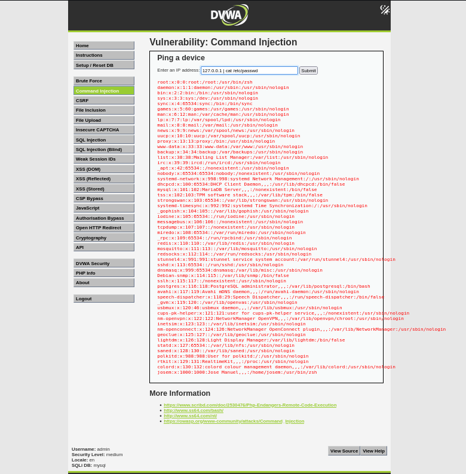

# Explotación de Command Injection - Nivel Medio (DVWA)

## Descripción de la Vulnerabilidad

La vulnerabilidad de Command Injection ocurre cuando una aplicación web no sanitiza adecuadamente la entrada del usuario, permitiendo la ejecución de comandos arbitrarios en el sistema operativo del servidor. En el nivel medio de DVWA, se intenta una defensa básica reemplazando los caracteres `&&` y `;` con espacios para prevenir inyecciones simples.

## Pasos para la Explotación

1.  **Identificar el punto de entrada:** El formulario solicita una dirección IP para realizar un ping. Este es el parámetro vulnerable.
2.  **Intentar la técnica de bypass:** La defensa implementada en este nivel intenta bloquear los caracteres `&&` y `;`. Para evadir esta protección, utilizaremos la **tubería (`|`)** para encadenar comandos. La tubería dirige la salida del primer comando (en este caso, el `ping`) a la entrada del segundo comando (`cat /etc/passwd`).
3.  **Ingresar el payload:** Introduce la siguiente entrada en el campo de la dirección IP:

    ```
    127.0.0.1 | cat /etc/passwd
    ```

4.  **Analizar el resultado:** Si la explotación es exitosa, la página mostrará el resultado del comando `ping` (que puede fallar o ser irrelevante) seguido del contenido del archivo `/etc/passwd`. Esto demuestra que el comando `cat /etc/passwd` se ejecutó en el servidor a través de la vulnerabilidad de Command Injection, omitiendo la defensa que intentaba bloquear los operadores `&&` y `;`.

**Importante:** Este ejercicio se realiza en un entorno controlado como DVWA con fines educativos para comprender las vulnerabilidades de seguridad. **Nunca intentes explotar vulnerabilidades en sistemas que no te pertenecen.**


