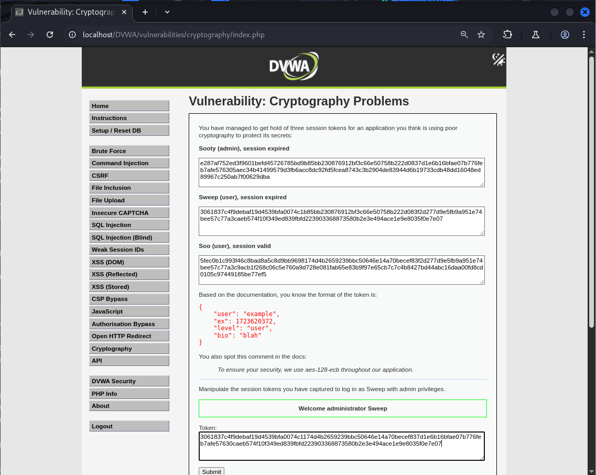

# Explotación de Vulnerabilidad Criptográfica en DVWA (Nivel Medio) - bypass de Privilegios

Este README describe brevemente la explotación de una vulnerabilidad criptográfica en el nivel de seguridad Medio de la sección "Cryptography" de DVWA (Damn Vulnerable Web Application), permitiendo un bypass de privilegios.

## Vulnerabilidad

La aplicación utiliza AES-128 en modo ECB (Electronic Codebook) para cifrar los tokens de sesión. El modo ECB cifra cada bloque de 128 bits de forma independiente con la misma clave. Esto tiene la consecuencia de que bloques de texto plano idénticos producirán bloques de texto cifrado idénticos. Además, el token de sesión carece de un mecanismo de integridad, lo que permite la manipulación de sus bloques cifrados.

El token de sesión se estructura en cuatro bloques de 32 caracteres hexadecimales (128 bits) que representan los campos: `user`, `ex`, `level` y `bio`.

## Pasos de Explotación

El objetivo es obtener privilegios de administrador manipulando los bloques del token de sesión de un usuario de bajo privilegio (Sweep) con bloques de un usuario administrador (Sooty) y un usuario con sesión válida (Soo).

1.  **Identificar los bloques del token:** Analizar los tokens proporcionados para Sooty, Sweep y Soo, dividiéndolos en bloques de 32 caracteres.

2.  **Obtener el bloque de expiración válido:** Copiar el bloque correspondiente al campo `ex` del token del usuario Soo, cuya sesión es válida. Ejemplo:

    ```
    174d4b2659239bbc50646e14a70becef
    ```

3.  **Obtener el bloque de nivel de administrador:** Copiar el bloque correspondiente al campo `level` del token del usuario Sooty, quien tiene privilegios de administrador. Ejemplo:

    ```
    837d1e6b16bfae07b776feb7afe57630
    ```

4.  **Construir un token manipulado:** Tomar el token del usuario Sweep y realizar las siguientes sustituciones:
    * Reemplazar el bloque de expiración (`ex`) de Sweep con el bloque de expiración válido de Soo.
    * Reemplazar el bloque de nivel (`level`) de Sweep con el bloque de nivel de administrador de Sooty.
    * Mantener los bloques correspondientes a `user` y `bio` del token de Sweep.

    Ejemplo de token manipulado resultante (basado en los ejemplos de bloques anteriores):

    ```
    3061837c4f9debaf19d4539bfa0074c1174d4b2659239bbc50646e14a70becef837d1e6b16bfae07b776feb7afe57630caeb574f10f349ed839fbfd223903368873580b2e3e494ace1e9e8035f0e7e07
    ```

5.  **Explotar la vulnerabilidad:**
    * Iniciar sesión en DVWA.
    * Navegar a la sección "Cryptography".
    * Pegar el token manipulado en el campo de entrada proporcionado.
    * Enviar el formulario.



## Resultado

Después de enviar el token manipulado, serás autenticado como el usuario Sweep, pero debido a la manipulación del bloque `level`, tendrás los privilegios de administrador. Esto demuestra cómo la falta de seguridad del modo de cifrado ECB y la ausencia de mecanismos de integridad permiten un bypass de autorización.