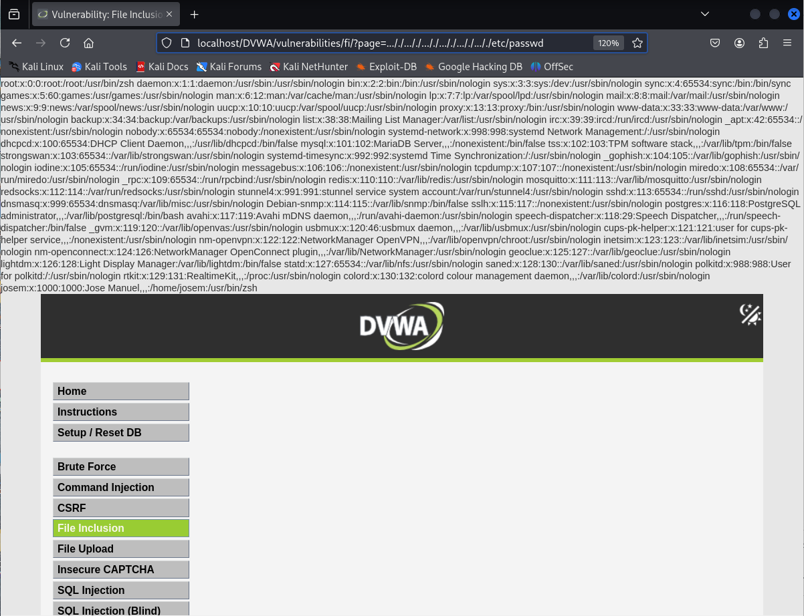

# Explotación de Vulnerabilidad File Inclusion - Nivel Medio

Este README describe brevemente la vulnerabilidad de File Inclusion y detalla cómo explotar una instancia de Local File Inclusion (LFI) en un escenario de seguridad de nivel medio, basándonos en los ejemplos proporcionados.

## Resumen de Vulnerabilidades File Inclusion

La vulnerabilidad de **File Inclusion** ocurre cuando una aplicación web permite que un usuario controle qué archivo se incluye o ejecuta. Esto puede llevar a la exposición de información sensible o la ejecución remota de código malicioso.

Existen dos tipos principales:

* **Local File Inclusion (LFI):** Permite incluir archivos presentes en el servidor web.
* **Remote File Inclusion (RFI):** Permite incluir archivos desde un servidor remoto.

## Explotación LFI - Nivel de Seguridad Medio

En el nivel de seguridad medio, la aplicación intenta prevenir ataques de path traversal eliminando las secuencias `http://`, `https://`, `../` y `..\`. Sin embargo, esta protección puede evitarse utilizando secuencias redundantes.

**Parámetro Vulnerable:** `page`

**Protección Implementada:** Eliminación de `http://`, `https://`, `../` y `..\`.

**Técnica de Bypassing:** Utilizar la secuencia `..././`. Al reemplazar la primera instancia de `../`, la secuencia redundante se transforma en `../`, permitiendo el recorrido de directorios.

**Ejemplo de Explotación para Acceder a `/etc/passwd`:**

Para acceder al archivo `/etc/passwd`, se manipula el parámetro `page` de la siguiente manera:

```
http://<IP_del_servidor>/DVWA/vulnerabilities/fi/?page=..././..././..././..././..././..././etc/passwd
```
Al procesar la URL, cada instancia de `..././` se convertirá en `../`, permitiendo navegar fuera del directorio de la aplicación y acceder al archivo deseado.

**Verificación:** Si la explotación es exitosa, el contenido del archivo `/etc/passwd` se mostrará en la respuesta de la aplicación.


