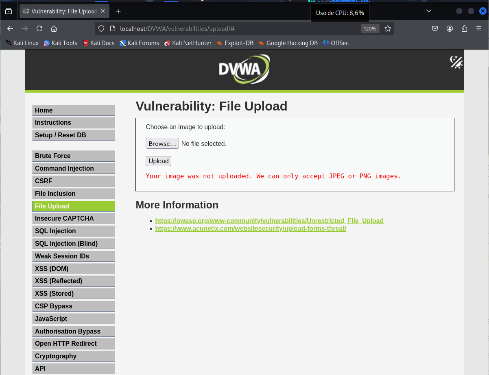
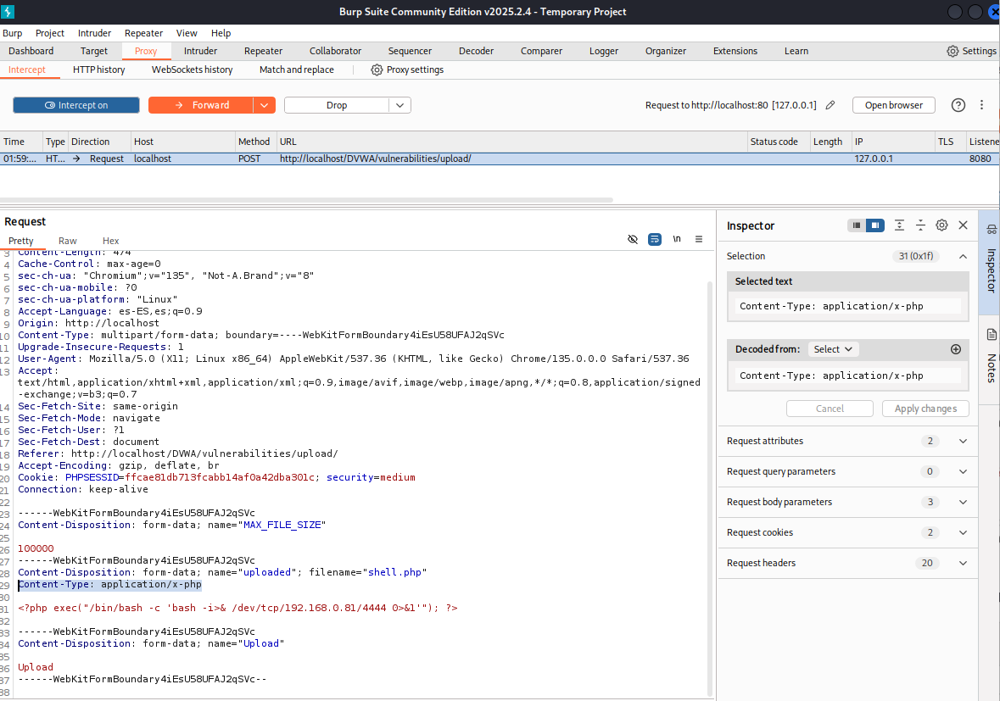
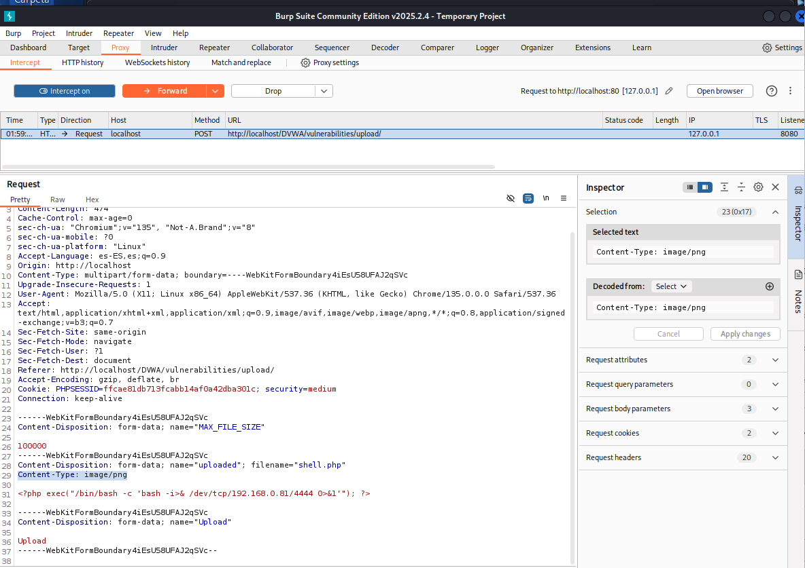
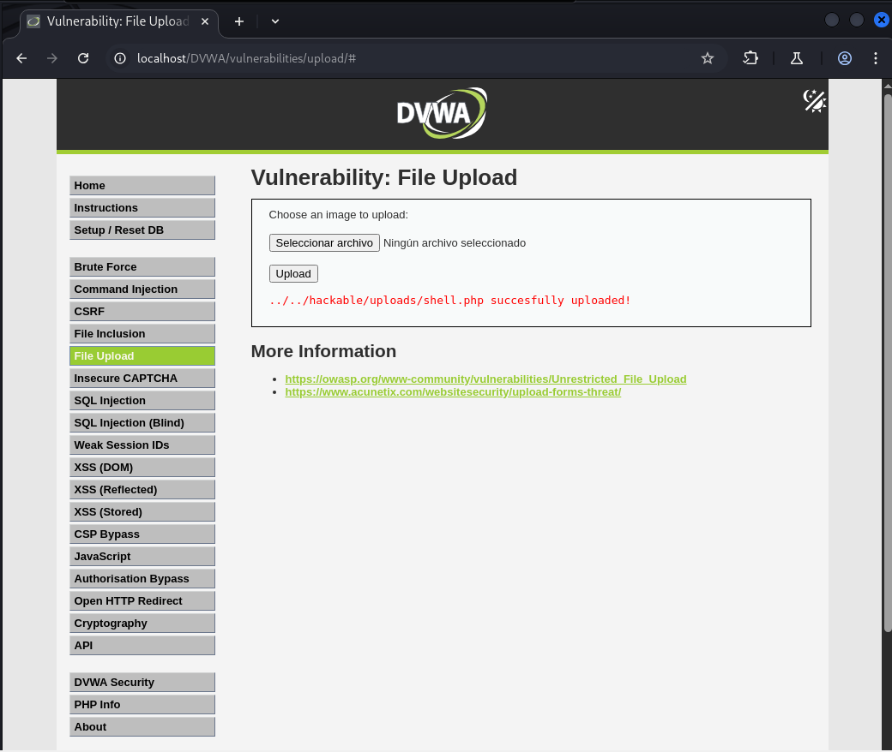
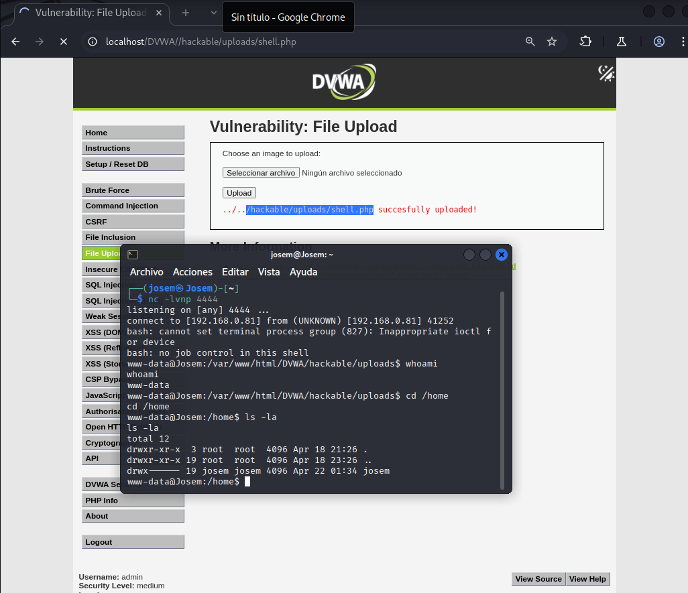

# Vulnerabilidad de File Upload - Nivel Medio

Este README describe brevemente la vulnerabilidad de File Upload y cómo explotarla en el nivel de seguridad Medio, basándonos en los ejemplos proporcionados.

## Resumen de la Vulnerabilidad de File Upload

La vulnerabilidad de File Upload ocurre cuando una aplicación web permite la subida de archivos sin validaciones de seguridad adecuadas, permitiendo a atacantes subir archivos maliciosos para su ejecución en el servidor.

## Explotación de la Vulnerabilidad de File Upload - Nivel de Seguridad Medio

### Análisis de las Protecciones

En el nivel de seguridad Medio, la aplicación implementa una validación básica, verificando que el archivo subido sea una imagen JPEG o PNG y que su tamaño sea menor a 100000 bytes.

### Intentando Subir un Archivo Malicioso Directamente

Al intentar subir un script PHP malicioso (ej., `shell.php`), la aplicación mostrará un error indicando que el archivo debe ser JPEG o PNG.



### Bypassing la Validación del Tipo de Archivo con Burp Suite

1.  **Interceptar la petición:** Utiliza Burp Suite para interceptar la petición de subida del archivo.



2.  **Modificar Content-Type:** Cambia la cabecera `Content-Type` de la petición a `image/png` (o `image/jpeg`). Esto valida la verificación del tipo de archivo.



3.  **Subir el archivo modificado:** Envía la petición modificada. La subida debería ser exitosa.



### Acceder al Archivo Subido y Obtener la Shell

1.  **Configurar el listener Netcat:** En tu máquina, inicia un listener Netcat en el puerto especificado en tu script malicioso:
```
    bash
    nc -lvnp <puerto_especificado>
```
2.  **Acceder al archivo:** Navega a la URL del archivo subido (ej., `http://<IP_del_servidor>/dvwa/hackable/uploads/shell.php`). La ejecución del script establecerá una reverse shell.
3.  **Obtener la reverse shell:** Recibirás una shell interactiva en tu terminal Netcat, permitiéndote ejecutar comandos en el servidor.



En resumen, en el nivel de seguridad Medio, la explotación de la vulnerabilidad File Upload se logra modificando la validación del tipo de archivo manipulando la cabecera `Content-Type` de la petición de subida utilizando herramientas como Burp Suite.
