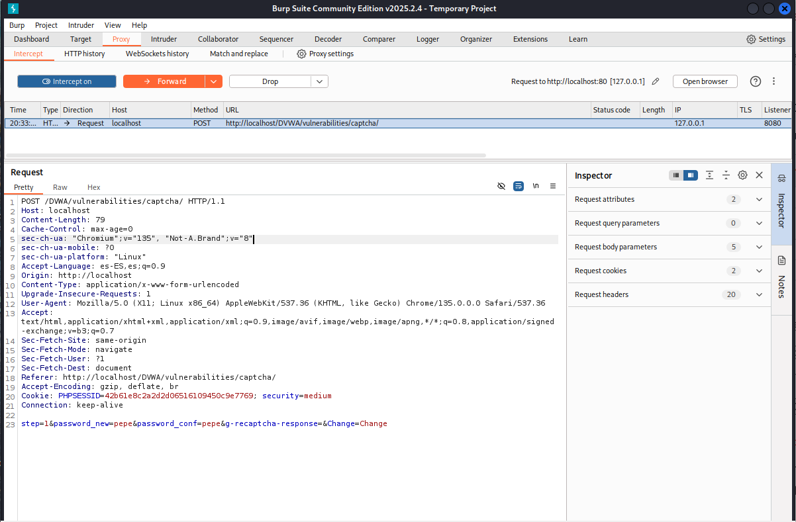

# Vulnerabilidad de Insecure CAPTCHA - Nivel Medio

Este README describe brevemente la vulnerabilidad de Insecure CAPTCHA y cómo explotarla en el nivel de seguridad Medio.

## Resumen de la Vulnerabilidad de Insecure CAPTCHA

La vulnerabilidad de Insecure CAPTCHA ocurre cuando un sistema CAPTCHA tiene fallos de seguridad que permiten explotarlo fácilmente por atacantes, a menudo debido a validaciones insuficientes en el servidor o dependencias en el lado del cliente manipulables.

## Explotación de la Vulnerabilidad de Insecure CAPTCHA - Nivel de Seguridad Medio

### Análisis de la Debilidad

En el nivel de seguridad Medio, la aplicación confía en un parámetro llamado `passed_captcha` para determinar si el CAPTCHA se resolvió correctamente. Esta verificación se realiza principalmente en el lado del cliente, lo que la hace vulnerable a la manipulación.

### Pasos para la Explotación

1.  **Interceptar la petición:** Utilizamos una herramienta como Burp Suite para interceptar la petición web antes de enviarla (al hacer clic en el botón de envío del formulario).

2.  **Manipular los parámetros:** En la petición interceptada, localiza el parámetro `step` y cámbialo a `2` (para intentar saltar el paso de verificación del CAPTCHA). Adicionalmente, **añade o modifica** el parámetro `passed_captcha` y establece su valor a `true`.

3.  **Enviar la petición modificada:** Envía la petición alterada al servidor.

### Resultado Esperado

Al establecer el parámetro `passed_captcha` a `true`, engañas al servidor haciéndole creer que el CAPTCHA se resolvió correctamente. Esto permite enviar la verificación del CAPTCHA y completar la operación sin necesidad de resolverlo.

En resumen, la explotación en el nivel Medio se centra en ** explotar ** la lógica del CAPTCHA manipulando un parámetro controlado por el cliente (`passed_captcha`) para que el servidor crea que la verificación fue exitosa.