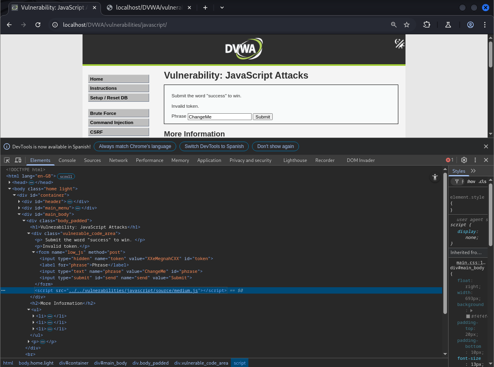
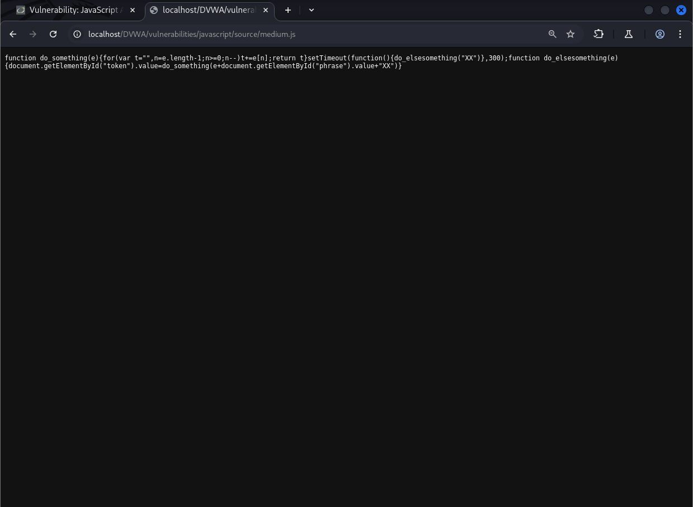
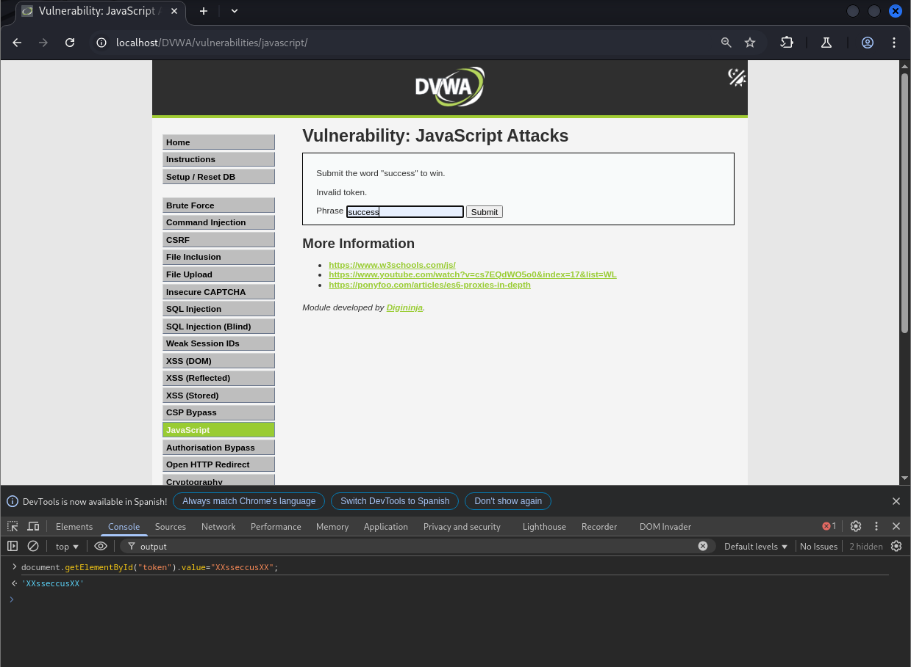
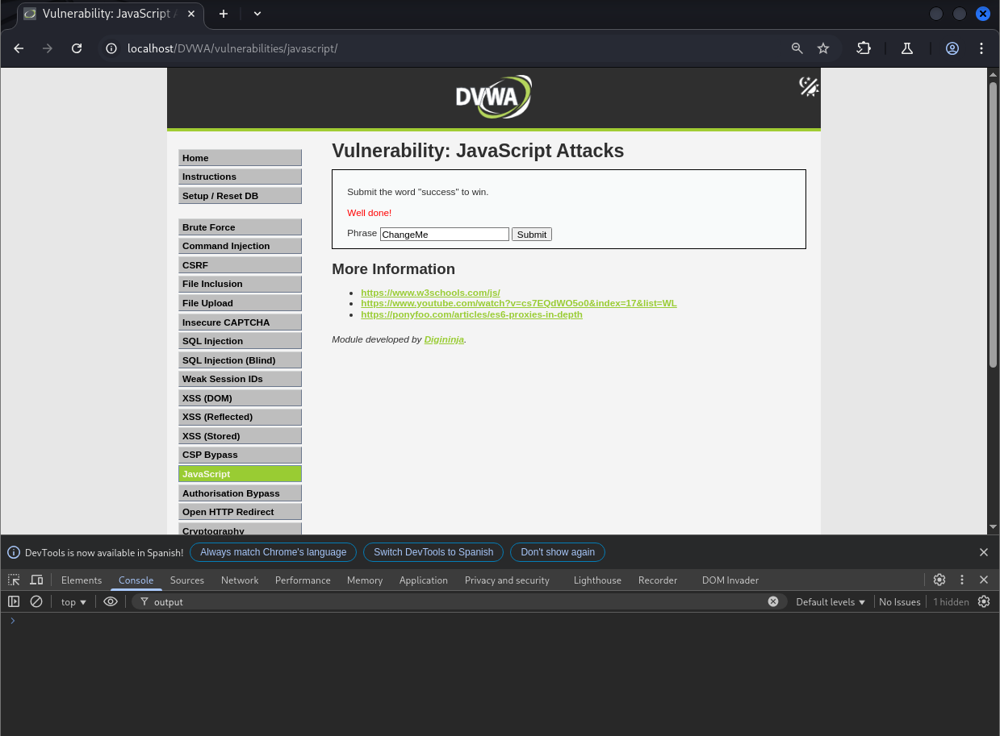

# Explotación de la Vulnerabilidad en DVWA - Nivel Medio (bypass)

Este README describe cómo explotar la vulnerabilidad en el nivel de seguridad Medio relacionada con la manipulación del token en el laboratorio web DVWA (Damn Vulnerable Web Application).

## Análisis del Código JavaScript



El código JavaScript en este nivel genera un token basado en el valor introducido en el campo "phrase". La función `do_elsesomething` construye una cadena concatenando "XX", el valor del campo "phrase", y "XX". Posteriormente, esta cadena es invertida por la función `do_something` y asignada al campo oculto "token".

Para que la validación del servidor tenga éxito, el valor del campo "token" debe ser "XXsseccusXX". Dado que `do_something` invierte la cadena, el valor antes de la inversión debe ser "XXsuccessXX".

La función `do_elsesomething` construye esta cadena como `"XX" + document.getElementById("phrase").value + "XX"`.

Por lo tanto, para que `"XX" + document.getElementById("phrase").value + "XX"` se convierta en "XXsuccessXX" después de la inversión, el valor del campo "phrase" debe ser "success".



## Explotación de la Vulnerabilidad 

En lugar de depender de la lógica de las funciones JavaScript para generar el token correcto, podemos manipular directamente el valor del campo "token" antes de enviar el formulario.

**Pasos para la Explotación:**

1.  En el campo de entrada del formulario (donde dice "Enter value here"), escribe la palabra **success**.
2.  Abre la **consola de desarrollador** de tu navegador (por ejemplo, en Chrome/Edge presiona F12, en Firefox presiona Control + Shift + K).
3.  En la consola, introduce el siguiente código JavaScript para establecer directamente el valor correcto del campo "token":

    ```javascript
    document.getElementById("token").value="XXsseccusXX";
    ```


4.  Haz clic en el botón **"Submit"**.

## Resultado de la Explotación

Al establecer directamente el valor esperado del "token" ("XXsseccusXX") antes de que el formulario sea enviado, cambiamos la lógica de las funciones JavaScript `do_something` y `do_elsesomething`. El servidor recibirá el valor correcto del token y mostrará el mensaje "Well done!".

