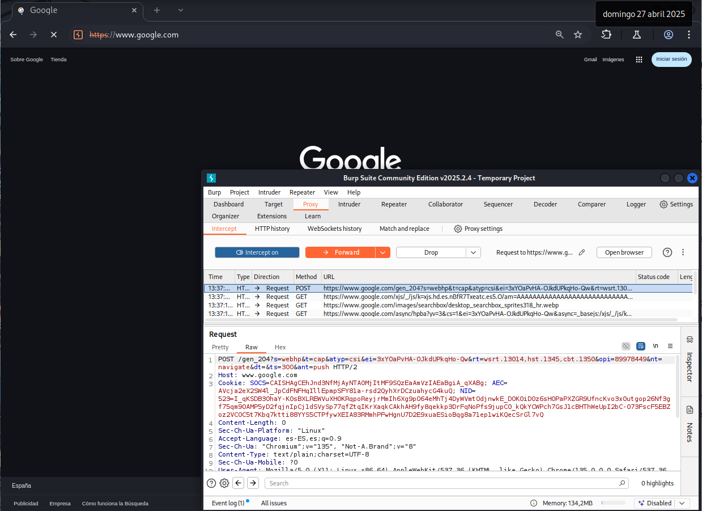

# Explotación de Open HTTP Redirect - Nivel Medio (DVWA)

Este README describe cómo explotar la vulnerabilidad de Open HTTP Redirect en el nivel de seguridad Medio de DVWA (Damn Vulnerable Web Application) utilizando Burp Suite.

## Análisis del Nivel de Seguridad Medio

En este nivel, la aplicación intenta prevenir redirecciones a URLs absolutas (externas). Sin embargo, **permite URLs relativas** (dentro del mismo sitio) y **URLs relativas al protocolo**. El parámetro vulnerable sigue siendo `redirect`.

## Explotación con Burp Suite

El objetivo es evitar la restricción que impide las redirecciones a sitios externos. Utilizaremos una URL relativa al protocolo para lograr esto.

**Pasos para la Explotación:**

1.  **Identificar el Parámetro de Redirección:** Navega a la página vulnerable de Open HTTP Redirect en DVWA. Observa la URL; generalmente contendrá el parámetro `redirect`.

2.  **Intentar una Redirección Absoluta (Observar el Bloqueo):** Intenta manipular el parámetro `redirect` con una URL absoluta a un sitio externo (por ejemplo, `https://google.com`). La aplicación debería bloquear esta redirección.

    ```
    ?redirect=[https://google.com](https://google.com)
    ```

3.  **Interceptar la Petición con Burp Suite:** Activa la interceptación en Burp Suite y vuelve a enviar la petición (o genera una nueva) a la página de redirección con el parámetro `redirect`.

4.  **Modificar el Parámetro `redirect` con una URL Relativa al Protocolo:** En la petición interceptada por Burp Suite, localiza el parámetro `redirect` y modifica su valor para que comience con `//` seguido de la URL del sitio malicioso. Esto indica al navegador que utilice el mismo protocolo que la página actual.

    Por ejemplo, para redirigir a `https://www.google.com`, modifica el parámetro a:

    ```
    ?redirect=//www.google.com
    ```


5.  **Reenviar la Petición Modificada:** Desactiva la interceptación en Burp Suite o reenvía la petición modificada al servidor.

## Resultado de la Explotación

El servidor procesará la URL relativa al protocolo. El navegador interpretará `//www.google.com` utilizando el protocolo actual (probablemente `http` o `https`) y **redirigirá exitosamente al sitio externo malicioso (`www.google.com`)**, evitando la restricción implementada en el nivel de seguridad Medio.

