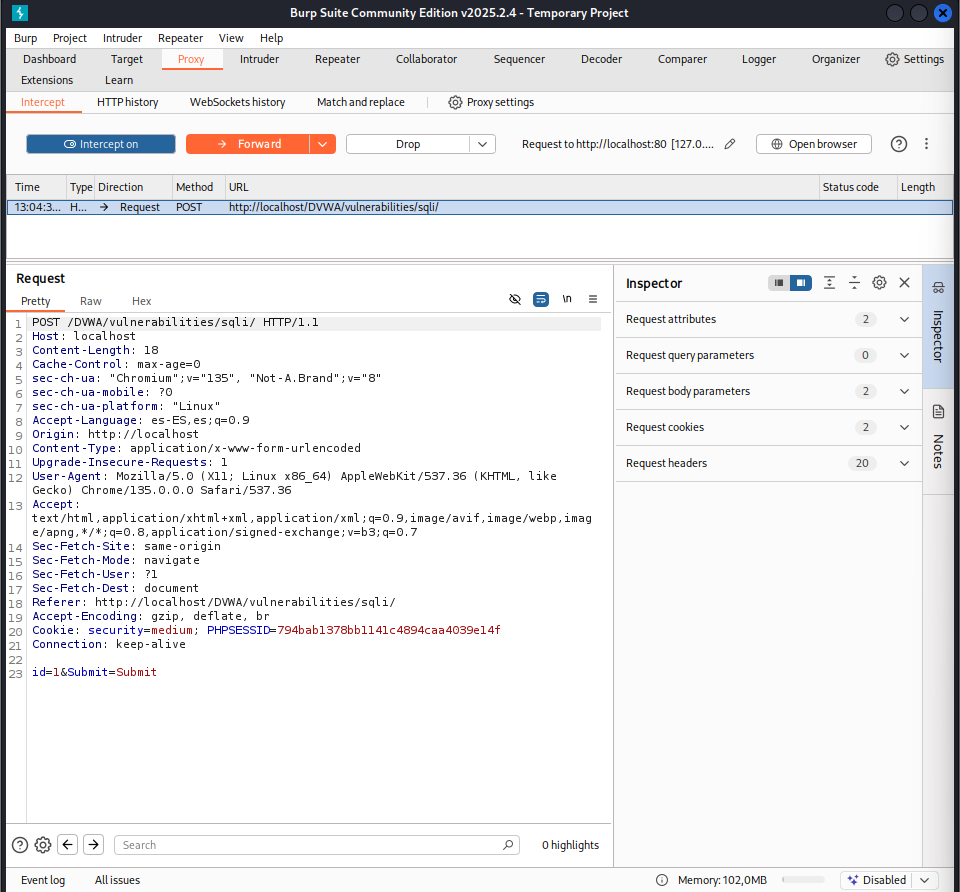
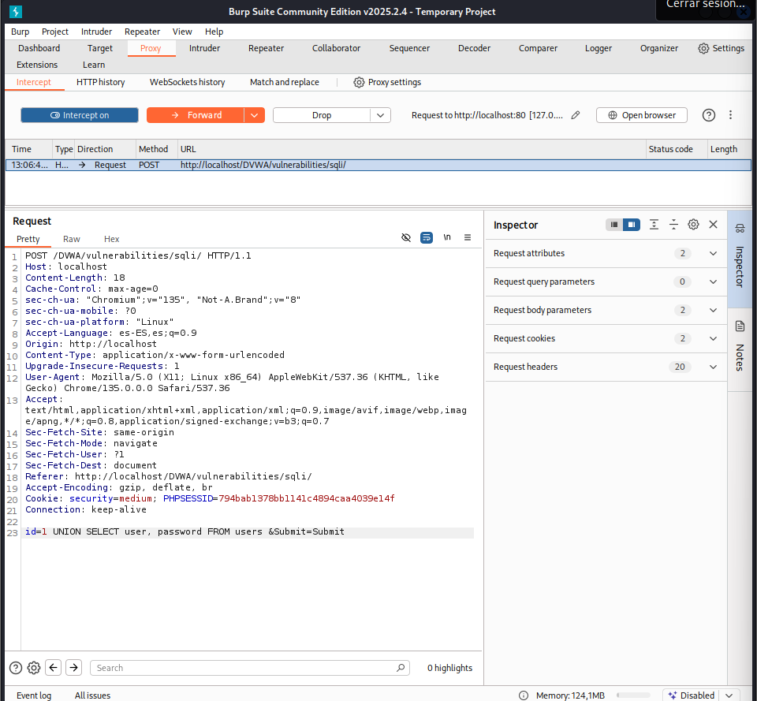
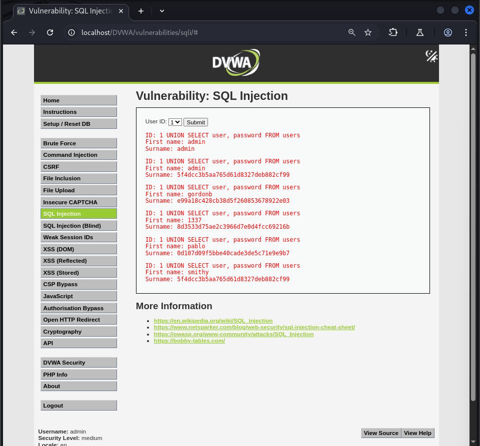

# Vulnerabilidad de SQL Injection - Nivel Medio

Este README describe brevemente la vulnerabilidad de SQL Injection y cómo explotarla en el nivel de seguridad Medio.

## Resumen de la Vulnerabilidad de SQL Injection

SQL Injection es una vulnerabilidad de seguridad que permite a los atacantes interferir con las consultas que una aplicación realiza a su base de datos. Al insertar código SQL malicioso en los campos de entrada de la aplicación (como formularios o parámetros en la URL), un atacante puede ejecutar comandos SQL no autorizados. Esto puede resultar en el acceso, la modificación o la eliminación de datos sensibles almacenados en la base de datos.

## Explotación de SQL Injection Paso a Paso:

La explotación de SQL Injection se centra en manipular las entradas de la aplicación para inyectar código SQL malicioso.

### Nivel de Seguridad Medio:

#### Identificar la protección implementada:
En este nivel de seguridad, se utiliza la función `mysqli_real_escape_string` para escapar caracteres especiales en la entrada del `ID`. Esto dificulta la inyección directa a través del formulario.

#### ** Evitar la protección utilizando herramientas de interceptación:**
Como la entrada directa a través del formulario está protegida, se utiliza una herramienta como Burp Suite para interceptar la petición HTTP antes de que llegue al servidor.



#### Modificar la petición:
En Burp Suite, se modifica el valor del parámetro `id` en la petición para incluir el payload SQL malicioso. Por ejemplo, para obtener nombres de usuario y contraseñas:

```
1 UNION SELECT user, password FROM users #
```



#### Enviar la petición modificada:
Burp Suite permite reenviar la petición manipulada al servidor.

#### Analizar la respuesta:
La respuesta del servidor mostrará los resultados de la consulta SQL inyectada, en este caso, los nombres de usuario y las contraseñas.



En resumen, la explotación de SQL Injection en el nivel Medio requiere evitar la protección `mysqli_real_escape_string` utilizando una herramienta de interceptación como Burp Suite para modificar la petición HTTP y enviar payloads SQL maliciosos directamente en los parámetros.