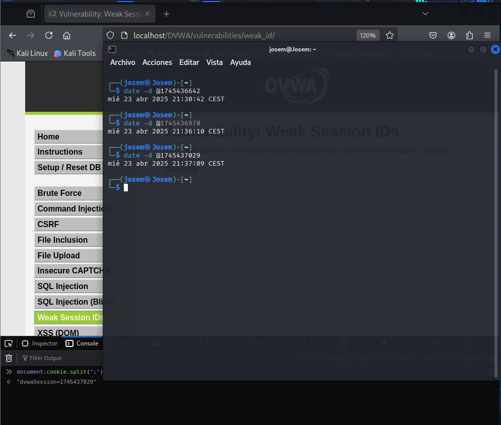

# Explotación de Vulnerabilidad de Predicción de IDs de Sesión (Nivel Medio)

Este repositorio documenta un ejercicio práctico para comprender la vulnerabilidad de predicción de IDs de sesión cuando estos se generan basándose directamente en la hora Unix.

## Nivel de Dificultad

Medio

## Herramientas Necesarias

Ninguna (aunque un convertidor de tiempo Unix puede ser útil).

## Pasos para la Explotación

### 1. Generar IDs de Sesión Propios

1.  Accede a la página web vulnerable.
2.  Haz clic varias veces en el botón "generate" (o la función que genere el ID de sesión).
3.  Abre las herramientas de desarrollo de tu navegador (normalmente presionando la tecla `F12`).
4.  Dirígete a la sección de "Almacenamiento" o "Cookies".
5.  Localiza la cookie llamada `dvwaSession`.
6.  Copia los valores generados para esta cookie.

### 2. Analizar el Formato del ID

Observa detenidamente el formato de los valores que copiaste de la cookie `dvwaSession`. Deberían parecer números enteros largos.

### 3. Confirmar la Hora Unix

1.  Sospechando que estos IDs son marcas de tiempo Unix, utiliza un convertidor de tiempo Unix online (puedes buscar "Unix time converter" en tu motor de búsqueda preferido) o una herramienta de línea de comandos que realice esta conversión.
2.  Introduce los valores de la cookie `dvwaSession` en el convertidor y observa la fecha y hora resultantes.
3.  Compara las horas convertidas con el momento exacto en que hiciste clic en el botón "generate" en la página web. Deberían coincidir aproximadamente, lo que confirma que el ID de sesión se basa en la hora Unix.

### 4. Inferir IDs de Sesión de Otros Usuarios (Conceptual)

Para poder inferir el ID de sesión de otro usuario, conceptualmente necesitarías conocer el momento preciso en que inició sesión en el sistema. Si tuvieras esta información (en segundos transcurridos desde la Época Unix), podrías calcular el valor probable de su cookie `dvwaSession` utilizando un convertidor de hora a Unix.

### 5. Posible Explotación (Conceptual)

**Escenario 1: Conociendo la hora de inicio de sesión**

Si conocieras la hora exacta en que otro usuario inició sesión, podrías intentar establecer el valor de tu propia cookie `dvwaSession` a ese valor convertido a hora Unix. Si la aplicación únicamente verifica el formato y la hora de inicio de la sesión sin implementar otras medidas de seguridad robustas (como la adición de aleatoriedad o un secreto), podrías potencialmente secuestrar su sesión activa.

**Escenario 2: Forzar un reinicio de sesión**

En un escenario más complejo que involucraría otras vulnerabilidades, podrías intentar forzar a un usuario a cerrar su sesión (si existiera una forma de hacerlo) y luego hacer que inicie sesión en un momento que tú pudieras controlar. Esto te permitiría predecir su nuevo ID de sesión.

## Conclusión

En este nivel de dificultad, la vulnerabilidad principal reside en la simplicidad del mecanismo de generación de IDs de sesión, que se basa directamente en la hora Unix sin incorporar ningún elemento de aleatoriedad significativo o secreto adicional. Si bien la predicción en tiempo real del ID de sesión de otro usuario es desafiante sin conocer su hora de inicio de sesión exacta, la falta de complejidad en la generación es la debilidad fundamental que se explota conceptualmente.

Es crucial entender que en sistemas del mundo real, los IDs de sesión seguros implementan mecanismos mucho más robustos, incluyendo una alta entropía generada por fuentes aleatorias seguras y a menudo se combinan con otros factores para prevenir la predicción y el secuestro de sesiones. Este ejercicio es puramente educativo para ilustrar una vulnerabilidad común en sistemas mal diseñados.